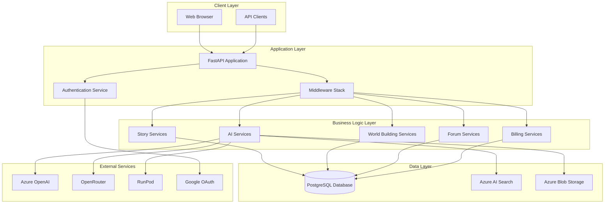
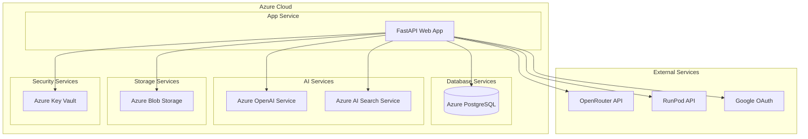
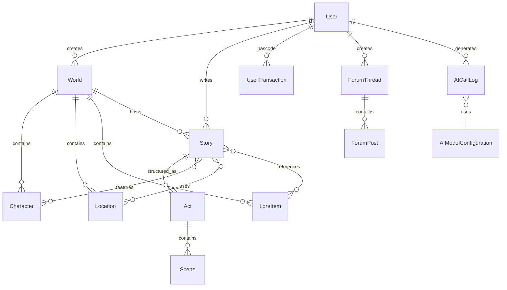

# Architecture Documentation Design

## Overview

The AI-powered storytelling platform is a comprehensive web application built on modern Python technologies, designed to enable users to create interactive stories, build fictional worlds, and collaborate with AI for creative writing. The system follows a microservices-oriented architecture with clear separation of concerns, leveraging Azure cloud services for AI capabilities, storage, and search functionality.

The platform serves multiple user types including writers, world builders, administrators, and community members, providing features ranging from basic story creation to advanced AI-assisted content generation and collaborative world building.

## Architecture

### High-Level Architecture

### Deployment Architecture

## Components and Interfaces

### Core Application Components

#### FastAPI Application (`app/main.py`)
- **Purpose**: Main application entry point and configuration
- **Responsibilities**:
  - Application lifecycle management
  - Middleware configuration
  - Router registration
  - Service initialization
  - Static file serving
- **Key Features**:
  - Async context manager for startup/shutdown
  - Comprehensive logging configuration
  - CORS and security middleware
  - Template engine setup with Jinja2

#### Authentication System (`app/routers/auth.py`, `app/routers/oauth.py`)
- **Purpose**: User authentication and authorization
- **Components**:
  - JWT-based authentication
  - Google OAuth integration
  - Session management
  - Role-based access control
- **Security Features**:
  - Argon2 password hashing
  - Secure session cookies
  - CSRF protection
  - Rate limiting

#### AI Services Layer
- **Azure OpenAI Integration** (`app/services/embedding_service.py`)
  - Text embeddings generation
  - Chat completions
  - Content moderation
- **Semantic Kernel Integration** (`app/services/sk_kernel_instance.py`)
  - Plugin-based AI functionality
  - Prompt management
  - Multi-model support
- **AI Search Service** (`app/services/azure_ai_search_service.py`)
  - Vector search capabilities
  - RAG (Retrieval Augmented Generation)
  - Content indexing

### Business Logic Components

#### Story Management System
- **Story Service**: Core story CRUD operations
- **Act Management**: Story structure with acts and scenes
- **Story Classes**: Genre and category management
- **Story Chat**: AI-powered story discussion
- **Story Publishing**: Public story sharing

#### World Building System
- **World Service**: World creation and management
- **Character Management**: Character profiles and relationships
- **Location System**: Geographic and spatial organization
- **Lore Management**: World history and mythology
- **World Chat**: AI-powered world exploration

#### Content Generation System
- **AI-Assisted Writing**: Real-time writing assistance
- **Scene Generation**: Automated scene creation
- **Image Generation**: AI-powered visual content
- **Story Wizard**: Guided story creation process

#### Community Features
- **Forum System**: Discussion threads and categories
- **User Profiles**: Account management and preferences
- **Social Sharing**: Content sharing and discovery
- **Rating System**: Community feedback and curation

#### Billing and Administration
- **Credit System**: Usage-based billing
- **Transaction Logging**: Financial audit trail
- **Admin Tools**: System management and monitoring
- **Cost Tracking**: AI usage monitoring

### Data Access Layer

#### Database Models (`app/models/`)
The system uses SQLAlchemy ORM with the following key entities:

**Core Entities**:
- `User`: User accounts and profiles
- `World`: Creative world containers
- `Story`: Story documents and metadata
- `Character`: Character profiles and attributes
- `Location`: Geographic and spatial entities
- `LoreItem`: World history and mythology

**Content Management**:
- `Act`: Story structure components
- `Scene`: Individual story scenes
- `UploadedDocument`: File management
- `GeneratedImage`: AI-generated visual content

**Community Features**:
- `ForumCategory`: Discussion organization
- `ForumThread`: Discussion topics
- `ForumPost`: Individual messages
- `PublishedStory`: Public story sharing

**System Management**:
- `AICallLog`: AI usage tracking
- `UserTransaction`: Billing records
- `JobStatus`: Background task management

## Data Models

### Entity Relationship Overview

### Key Data Relationships

#### Hierarchical Relationships
- **User → World → Stories**: Users create worlds that contain multiple stories
- **Story → Acts → Scenes**: Stories are structured hierarchically
- **World → Elements**: Worlds contain characters, locations, and lore items

#### Association Relationships
- **Story Associations**: Stories can reference characters, locations, and lore items
- **Scene Associations**: Individual scenes can feature specific world elements
- **User Relationships**: Users can collaborate on worlds and stories

#### System Relationships
- **AI Usage Tracking**: All AI calls are logged with cost and usage metrics
- **Content Relationships**: Generated images and documents are linked to their contexts

## Error Handling

### Error Handling Strategy

#### Application-Level Error Handling
- **Global Exception Handlers**: Centralized error processing
- **HTTP Status Code Mapping**: Consistent API error responses
- **Logging Integration**: Comprehensive error logging with context
- **User-Friendly Messages**: Sanitized error messages for end users

#### Service-Level Error Handling
- **AI Service Failures**: Graceful degradation when AI services are unavailable
- **Database Connection Issues**: Connection pooling and retry logic
- **External API Failures**: Circuit breaker patterns for external services
- **File Upload Errors**: Validation and storage error handling

#### Data Validation
- **Pydantic Models**: Request/response validation
- **Database Constraints**: Data integrity enforcement
- **Business Rule Validation**: Domain-specific validation logic
- **Input Sanitization**: XSS and injection prevention

### Error Recovery Patterns

#### Retry Mechanisms
- **Exponential Backoff**: For transient failures
- **Circuit Breakers**: For external service protection
- **Fallback Strategies**: Alternative processing paths

#### Data Consistency
- **Transaction Management**: ACID compliance for critical operations
- **Eventual Consistency**: For non-critical background processes
- **Conflict Resolution**: For concurrent editing scenarios

## Testing Strategy

### Testing Architecture

#### Unit Testing
- **Service Layer Testing**: Business logic validation
- **Model Testing**: Data validation and relationships
- **Utility Function Testing**: Helper function verification
- **Mock Integration**: External service mocking

#### Integration Testing
- **API Endpoint Testing**: Full request/response cycle testing
- **Database Integration**: Real database interaction testing
- **AI Service Integration**: External service integration testing
- **Authentication Flow Testing**: Security mechanism validation

#### End-to-End Testing
- **User Journey Testing**: Complete workflow validation
- **Cross-Service Testing**: Multi-component interaction testing
- **Performance Testing**: Load and stress testing
- **Security Testing**: Vulnerability assessment

### Testing Infrastructure

#### Test Environment Management
- **Docker Compose**: Isolated testing environments
- **Test Database**: Separate database for testing
- **Mock Services**: Simulated external dependencies
- **Test Data Management**: Consistent test data setup

#### Continuous Integration
- **Automated Testing**: CI/CD pipeline integration
- **Code Coverage**: Comprehensive coverage reporting
- **Quality Gates**: Automated quality checks
- **Deployment Testing**: Production-like environment validation

### Quality Assurance

#### Code Quality
- **Linting**: Code style enforcement
- **Type Checking**: Static type validation
- **Security Scanning**: Vulnerability detection
- **Performance Profiling**: Performance bottleneck identification

#### Documentation Testing
- **API Documentation**: OpenAPI specification validation
- **Code Documentation**: Docstring completeness
- **Architecture Documentation**: Design consistency validation

## Diagram Export and PDF Generation

### Mermaid Diagram Export Options

The architecture diagrams in this document are written in Mermaid syntax and can be exported to various formats:

#### Online Tools
- **Mermaid Live Editor**: https://mermaid.live/
  - Copy diagram code and export as PNG, SVG, or PDF
  - High-quality vector graphics suitable for documentation

#### Command Line Tools
- **Mermaid CLI**: Install with `npm install -g @mermaid-js/mermaid-cli`
  - Export command: `mmdc -i diagram.mmd -o diagram.pdf`
  - Supports PNG, SVG, PDF formats

#### IDE Extensions
- **VS Code**: Mermaid Preview extension
- **IntelliJ/PyCharm**: Mermaid plugin
- **Markdown editors**: Most support Mermaid rendering

#### PDF Generation Workflow
1. Copy individual diagram code blocks from this document
2. Use Mermaid Live Editor or CLI to export as SVG/PDF
3. Combine with document text using tools like:
   - Pandoc: `pandoc design.md -o architecture.pdf`
   - GitBook or similar documentation platforms
   - LaTeX with mermaid package integration

#### Automated Documentation Pipeline
For continuous documentation updates, consider:
- GitHub Actions with Mermaid CLI
- GitLab CI/CD with diagram generation
- Documentation platforms like GitBook, Notion, or Confluence that support Mermaid