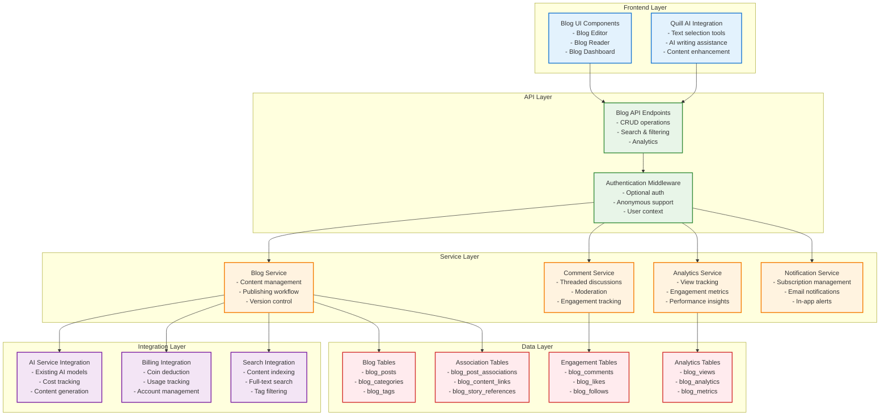

# Blogging Engine Design Document

## Table of Contents
- [Overview](#overview)
- [Architecture](#architecture)
- [Components and Interfaces](#components-and-interfaces)
- [Data Models](#data-models)
- [Error Handling](#error-handling)
- [Testing Strategy](#testing-strategy)

## Overview

The blogging engine is designed as a comprehensive content management system that integrates seamlessly with the existing storytelling platform. It provides full blogging capabilities including content creation, discovery, engagement, and analytics while maintaining the platform's existing architecture patterns and AI integration capabilities.

### Design Principles

#### Modular Architecture
- **Self-contained Module**: All blog functionality is contained within new database tables and services
- **Clean Integration**: Leverages existing platform services (AI, billing, authentication) without modification
- **Scalable Design**: Built to handle growth in content and user engagement

#### Anonymous-First Design
- **Public Access**: All blog reading functionality works without authentication
- **Progressive Enhancement**: Additional features available for logged-in users
- **SEO Optimized**: Content discoverable by search engines and social platforms

#### AI-Powered Content Creation
- **Existing AI Integration**: Uses the platform's established Quill AI-centric approach
- **Cost Management**: Integrates with existing billing and coin system
- **Seamless Experience**: AI assistance feels natural within the blog editor

## Architecture

### System Architecture Overview



### Component Integration Strategy

#### Existing Service Reuse
- **AI Services**: Leverage existing AI model configuration, cost tracking, and Semantic Kernel integration
- **Billing Services**: Use established coin system and transaction management
- **Authentication**: Extend existing auth system to support optional authentication
- **Search Services**: Integrate with Azure AI Search for content discovery

#### New Service Development
- **Blog Management**: New service for content lifecycle management
- **Comment System**: Threaded discussion system with moderation capabilities
- **Analytics Engine**: Comprehensive tracking and reporting system
- **Notification System**: Subscription and alert management

## Components and Interfaces

### Blog Management Service

#### Core Blog Service Interface
```python
class BlogService:
    \"\"\"Core blog management service.\"\"\"
    
    async def create_post(
        self, 
        db: AsyncSession, 
        post_data: BlogPostCreate, 
        user_id: Optional[int] = None
    ) -> BlogPost:
        \"\"\"Create a new blog post with draft status.\"\"\"
    
    async def publish_post(
        self, 
        db: AsyncSession, 
        post_id: int, 
        user_id: int
    ) -> BlogPost:
        \"\"\"Publish a draft blog post.\"\"\"
    
    async def get_published_posts(
        self, 
        db: AsyncSession, 
        skip: int = 0, 
        limit: int = 20,
        category_id: Optional[int] = None,
        tag_ids: Optional[List[int]] = None,
        search_query: Optional[str] = None
    ) -> List[BlogPost]:
        \"\"\"Get published blog posts with filtering and pagination.\"\"\"
    
    async def get_post_by_slug(
        self, 
        db: AsyncSession, 
        slug: str
    ) -> Optional[BlogPost]:
        \"\"\"Get blog post by SEO-friendly slug.\"\"\"
    
    async def update_post(
        self, 
        db: AsyncSession, 
        post_id: int, 
        post_data: BlogPostUpdate, 
        user_id: int
    ) -> BlogPost:
        \"\"\"Update blog post with version tracking.\"\"\"
    
    async def soft_delete_post(
        self, 
        db: AsyncSession, 
        post_id: int, 
        user_id: int
    ) -> bool:
        \"\"\"Soft delete blog post.\"\"\"
```

#### AI Integration Service
```python
class BlogAIService:
    \"\"\"AI integration service for blog content.\"\"\"
    
    async def enhance_content(
        self,
        db: AsyncSession,
        user_id: int,
        content: str,
        enhancement_type: AIEnhancementType,
        model_config_id: Optional[int] = None
    ) -> AIEnhancementResult:
        \"\"\"Enhance blog content using AI.\"\"\"
    
    async def generate_title_suggestions(
        self,
        db: AsyncSession,
        user_id: int,
        content: str,
        count: int = 5
    ) -> List[str]:
        \"\"\"Generate title suggestions based on content.\"\"\"
    
    async def generate_tags(
        self,
        db: AsyncSession,
        user_id: int,
        title: str,
        content: str
    ) -> List[str]:
        \"\"\"Generate relevant tags for blog post.\"\"\"
    
    async def generate_excerpt(
        self,
        db: AsyncSession,
        user_id: int,
        content: str,
        max_length: int = 200
    ) -> str:
        \"\"\"Generate blog post excerpt.\"\"\"
```

### Comment and Engagement System

#### Comment Service Interface
```python
class CommentService:
    \"\"\"Blog comment management service.\"\"\"
    
    async def create_comment(
        self,
        db: AsyncSession,
        comment_data: BlogCommentCreate,
        user_id: int,
        post_id: int,
        parent_comment_id: Optional[int] = None
    ) -> BlogComment:
        \"\"\"Create a new comment or reply.\"\"\"
    
    async def get_post_comments(
        self,
        db: AsyncSession,
        post_id: int,
        skip: int = 0,
        limit: int = 50
    ) -> List[BlogComment]:
        \"\"\"Get comments for a blog post with threading.\"\"\"
    
    async def moderate_comment(
        self,
        db: AsyncSession,
        comment_id: int,
        action: ModerationAction,
        moderator_id: int
    ) -> bool:
        \"\"\"Moderate comment (approve, reject, delete).\"\"\"
    
    async def report_comment(
        self,
        db: AsyncSession,
        comment_id: int,
        reporter_id: int,
        reason: str
    ) -> bool:
        \"\"\"Report inappropriate comment.\"\"\"
```

#### Engagement Service Interface
```python
class EngagementService:
    \"\"\"Blog engagement tracking service.\"\"\"
    
    async def like_post(
        self,
        db: AsyncSession,
        post_id: int,
        user_id: int
    ) -> bool:
        \"\"\"Like or unlike a blog post.\"\"\"
    
    async def follow_author(
        self,
        db: AsyncSession,
        author_id: int,
        follower_id: int
    ) -> bool:
        \"\"\"Follow or unfollow a blog author.\"\"\"
    
    async def track_view(
        self,
        db: AsyncSession,
        post_id: int,
        user_id: Optional[int] = None,
        ip_address: Optional[str] = None,
        user_agent: Optional[str] = None
    ) -> bool:
        \"\"\"Track blog post view for analytics.\"\"\"
    
    async def get_engagement_metrics(
        self,
        db: AsyncSession,
        post_id: int
    ) -> EngagementMetrics:
        \"\"\"Get engagement metrics for a post.\"\"\"
```

### Analytics and Reporting System

#### Analytics Service Interface
```python
class BlogAnalyticsService:
    \"\"\"Blog analytics and reporting service.\"\"\"
    
    async def get_post_analytics(
        self,
        db: AsyncSession,
        post_id: int,
        user_id: int,
        date_range: Optional[DateRange] = None
    ) -> PostAnalytics:
        \"\"\"Get detailed analytics for a specific post.\"\"\"
    
    async def get_author_dashboard(
        self,
        db: AsyncSession,
        author_id: int,
        date_range: Optional[DateRange] = None
    ) -> AuthorDashboard:
        \"\"\"Get author dashboard with all posts analytics.\"\"\"
    
    async def get_trending_posts(
        self,
        db: AsyncSession,
        time_period: TrendingPeriod = TrendingPeriod.WEEK,
        limit: int = 10
    ) -> List[TrendingPost]:
        \"\"\"Get trending blog posts.\"\"\"
    
    async def generate_analytics_report(
        self,
        db: AsyncSession,
        author_id: int,
        report_type: ReportType,
        date_range: DateRange
    ) -> AnalyticsReport:
        \"\"\"Generate comprehensive analytics report.\"\"\"
```

## Data Models

### Core Blog Tables

#### Blog Posts Table
```sql
CREATE TABLE blog_posts (
    id SERIAL PRIMARY KEY,
    title VARCHAR(255) NOT NULL,
    slug VARCHAR(255) UNIQUE NOT NULL,
    content TEXT NOT NULL,
    excerpt TEXT,
    featured_image_url VARCHAR(500),
    status VARCHAR(20) NOT NULL DEFAULT 'draft', -- draft, published, archived
    author_id INTEGER NOT NULL REFERENCES users(id),
    category_id INTEGER REFERENCES blog_categories(id),
    view_count INTEGER DEFAULT 0,
    like_count INTEGER DEFAULT 0,
    comment_count INTEGER DEFAULT 0,
    meta_title VARCHAR(255),
    meta_description TEXT,
    meta_keywords TEXT,
    published_at TIMESTAMP,
    created_at TIMESTAMP DEFAULT CURRENT_TIMESTAMP,
    updated_at TIMESTAMP DEFAULT CURRENT_TIMESTAMP,
    deleted_at TIMESTAMP,
    
    -- SEO and sharing
    og_title VARCHAR(255),
    og_description TEXT,
    og_image_url VARCHAR(500),
    
    -- Content flags
    is_featured BOOLEAN DEFAULT FALSE,
    allow_comments BOOLEAN DEFAULT TRUE,
    is_ai_generated BOOLEAN DEFAULT FALSE,
    
    -- Search optimization
    search_vector tsvector,
    
    INDEX idx_blog_posts_author (author_id),
    INDEX idx_blog_posts_status (status),
    INDEX idx_blog_posts_published (published_at),
    INDEX idx_blog_posts_slug (slug),
    INDEX idx_blog_posts_category (category_id),
    INDEX idx_blog_posts_search (search_vector)
);
```

#### Blog Categories Table
```sql
CREATE TABLE blog_categories (
    id SERIAL PRIMARY KEY,
    name VARCHAR(100) NOT NULL UNIQUE,
    slug VARCHAR(100) NOT NULL UNIQUE,
    description TEXT,
    color VARCHAR(7), -- Hex color code
    icon VARCHAR(50), -- Icon class or emoji
    post_count INTEGER DEFAULT 0,
    display_order INTEGER DEFAULT 0,
    is_active BOOLEAN DEFAULT TRUE,
    created_at TIMESTAMP DEFAULT CURRENT_TIMESTAMP,
    updated_at TIMESTAMP DEFAULT CURRENT_TIMESTAMP,
    
    INDEX idx_blog_categories_slug (slug),
    INDEX idx_blog_categories_active (is_active)
);
```

#### Blog Tags Table
```sql
CREATE TABLE blog_tags (
    id SERIAL PRIMARY KEY,
    name VARCHAR(50) NOT NULL UNIQUE,
    slug VARCHAR(50) NOT NULL UNIQUE,
    description TEXT,
    usage_count INTEGER DEFAULT 0,
    created_at TIMESTAMP DEFAULT CURRENT_TIMESTAMP,
    
    INDEX idx_blog_tags_slug (slug),
    INDEX idx_blog_tags_usage (usage_count)
);

CREATE TABLE blog_post_tags (
    id SERIAL PRIMARY KEY,
    post_id INTEGER NOT NULL REFERENCES blog_posts(id) ON DELETE CASCADE,
    tag_id INTEGER NOT NULL REFERENCES blog_tags(id) ON DELETE CASCADE,
    created_at TIMESTAMP DEFAULT CURRENT_TIMESTAMP,
    
    UNIQUE KEY unique_post_tag (post_id, tag_id),
    INDEX idx_blog_post_tags_post (post_id),
    INDEX idx_blog_post_tags_tag (tag_id)
);
```

### Engagement Tables

#### Blog Comments Table
```sql
CREATE TABLE blog_comments (
    id SERIAL PRIMARY KEY,
    post_id INTEGER NOT NULL REFERENCES blog_posts(id) ON DELETE CASCADE,
    author_id INTEGER NOT NULL REFERENCES users(id),
    parent_comment_id INTEGER REFERENCES blog_comments(id),
    content TEXT NOT NULL,
    status VARCHAR(20) DEFAULT 'approved', -- pending, approved, rejected, deleted
    like_count INTEGER DEFAULT 0,
    reply_count INTEGER DEFAULT 0,
    is_author_reply BOOLEAN DEFAULT FALSE, -- True if post author replied
    created_at TIMESTAMP DEFAULT CURRENT_TIMESTAMP,
    updated_at TIMESTAMP DEFAULT CURRENT_TIMESTAMP,
    deleted_at TIMESTAMP,
    
    INDEX idx_blog_comments_post (post_id),
    INDEX idx_blog_comments_author (author_id),
    INDEX idx_blog_comments_parent (parent_comment_id),
    INDEX idx_blog_comments_status (status),
    INDEX idx_blog_comments_created (created_at)
);
```

#### Blog Likes Table
```sql
CREATE TABLE blog_likes (
    id SERIAL PRIMARY KEY,
    post_id INTEGER NOT NULL REFERENCES blog_posts(id) ON DELETE CASCADE,
    user_id INTEGER NOT NULL REFERENCES users(id) ON DELETE CASCADE,
    created_at TIMESTAMP DEFAULT CURRENT_TIMESTAMP,
    
    UNIQUE KEY unique_post_like (post_id, user_id),
    INDEX idx_blog_likes_post (post_id),
    INDEX idx_blog_likes_user (user_id)
);
```

#### Blog Follows Table
```sql
CREATE TABLE blog_follows (
    id SERIAL PRIMARY KEY,
    author_id INTEGER NOT NULL REFERENCES users(id) ON DELETE CASCADE,
    follower_id INTEGER NOT NULL REFERENCES users(id) ON DELETE CASCADE,
    notification_enabled BOOLEAN DEFAULT TRUE,
    created_at TIMESTAMP DEFAULT CURRENT_TIMESTAMP,
    
    UNIQUE KEY unique_author_follower (author_id, follower_id),
    INDEX idx_blog_follows_author (author_id),
    INDEX idx_blog_follows_follower (follower_id)
);
```

### Analytics Tables

#### Blog Views Table
```sql
CREATE TABLE blog_views (
    id SERIAL PRIMARY KEY,
    post_id INTEGER NOT NULL REFERENCES blog_posts(id) ON DELETE CASCADE,
    user_id INTEGER REFERENCES users(id),
    ip_address INET,
    user_agent TEXT,
    referrer_url VARCHAR(500),
    session_id VARCHAR(100),
    view_duration INTEGER, -- seconds spent reading
    created_at TIMESTAMP DEFAULT CURRENT_TIMESTAMP,
    
    INDEX idx_blog_views_post (post_id),
    INDEX idx_blog_views_user (user_id),
    INDEX idx_blog_views_created (created_at),
    INDEX idx_blog_views_ip (ip_address)
);
```

#### Blog Analytics Summary Table
```sql
CREATE TABLE blog_analytics_summary (
    id SERIAL PRIMARY KEY,
    post_id INTEGER NOT NULL REFERENCES blog_posts(id) ON DELETE CASCADE,
    date DATE NOT NULL,
    unique_views INTEGER DEFAULT 0,
    total_views INTEGER DEFAULT 0,
    new_likes INTEGER DEFAULT 0,
    new_comments INTEGER DEFAULT 0,
    avg_read_time INTEGER DEFAULT 0, -- seconds
    bounce_rate DECIMAL(5,2) DEFAULT 0.00,
    social_shares INTEGER DEFAULT 0,
    created_at TIMESTAMP DEFAULT CURRENT_TIMESTAMP,
    updated_at TIMESTAMP DEFAULT CURRENT_TIMESTAMP,
    
    UNIQUE KEY unique_post_date (post_id, date),
    INDEX idx_blog_analytics_post (post_id),
    INDEX idx_blog_analytics_date (date)
);
```

### Integration Tables

#### Blog Post Associations Table
```sql
CREATE TABLE blog_post_associations (
    id SERIAL PRIMARY KEY,
    post_id INTEGER NOT NULL REFERENCES blog_posts(id) ON DELETE CASCADE,
    association_type VARCHAR(20) NOT NULL, -- story, world, character, location
    association_id INTEGER NOT NULL,
    association_title VARCHAR(255), -- Cached title for performance
    created_at TIMESTAMP DEFAULT CURRENT_TIMESTAMP,
    
    INDEX idx_blog_associations_post (post_id),
    INDEX idx_blog_associations_type_id (association_type, association_id),
    INDEX idx_blog_associations_created (created_at)
);
```

#### Blog Content Links Table
```sql
CREATE TABLE blog_content_links (
    id SERIAL PRIMARY KEY,
    post_id INTEGER NOT NULL REFERENCES blog_posts(id) ON DELETE CASCADE,
    link_type VARCHAR(20) NOT NULL, -- character, location, lore_item
    link_id INTEGER NOT NULL,
    link_text VARCHAR(255), -- The text that was linked
    link_context TEXT, -- Surrounding context
    created_at TIMESTAMP DEFAULT CURRENT_TIMESTAMP,
    
    INDEX idx_blog_content_links_post (post_id),
    INDEX idx_blog_content_links_type_id (link_type, link_id)
);
```

### Author Profile Extensions

#### Blog Author Profiles Table
```sql
CREATE TABLE blog_author_profiles (
    id SERIAL PRIMARY KEY,
    user_id INTEGER NOT NULL REFERENCES users(id) ON DELETE CASCADE,
    bio TEXT,
    profile_image_url VARCHAR(500),
    website_url VARCHAR(255),
    twitter_handle VARCHAR(50),
    instagram_handle VARCHAR(50),
    linkedin_url VARCHAR(255),
    
    -- Blog settings
    allow_comments_default BOOLEAN DEFAULT TRUE,
    auto_publish BOOLEAN DEFAULT FALSE,
    email_notifications BOOLEAN DEFAULT TRUE,
    
    -- Statistics
    total_posts INTEGER DEFAULT 0,
    total_views INTEGER DEFAULT 0,
    total_likes INTEGER DEFAULT 0,
    follower_count INTEGER DEFAULT 0,
    
    created_at TIMESTAMP DEFAULT CURRENT_TIMESTAMP,
    updated_at TIMESTAMP DEFAULT CURRENT_TIMESTAMP,
    
    UNIQUE KEY unique_user_profile (user_id),
    INDEX idx_blog_author_profiles_user (user_id)
);
```

## Error Handling

### Error Classification

#### Blog-Specific Errors
```python
class BlogError(Exception):
    \"\"\"Base exception for blog-related errors.\"\"\"
    pass

class BlogPostNotFoundError(BlogError):
    \"\"\"Blog post not found.\"\"\"
    pass

class BlogPostAccessDeniedError(BlogError):
    \"\"\"Access denied to blog post.\"\"\"
    pass

class BlogPostPublishError(BlogError):
    \"\"\"Error publishing blog post.\"\"\"
    pass

class BlogCommentError(BlogError):
    \"\"\"Error with blog comment operations.\"\"\"
    pass

class BlogModerationError(BlogError):
    \"\"\"Error with content moderation.\"\"\"
    pass
```

#### Error Response Patterns
```python
@router.get(\"/posts/{post_slug}\")
async def get_blog_post(
    post_slug: str,
    db: AsyncSession = Depends(get_db_session),
    current_user: Optional[User] = Depends(get_current_user_optional)
):
    \"\"\"Get blog post by slug with proper error handling.\"\"\"
    try:
        post = await blog_service.get_post_by_slug(db, post_slug)
        
        if not post:
            raise HTTPException(
                status_code=status.HTTP_404_NOT_FOUND,
                detail=\"Blog post not found\"
            )
        
        # Check if post is published or user is author
        if post.status != \"published\" and (not current_user or current_user.id != post.author_id):
            raise HTTPException(
                status_code=status.HTTP_404_NOT_FOUND,
                detail=\"Blog post not found\"
            )
        
        # Track view for analytics
        await analytics_service.track_view(
            db, 
            post.id, 
            current_user.id if current_user else None
        )
        
        return post
        
    except BlogPostNotFoundError:
        raise HTTPException(
            status_code=status.HTTP_404_NOT_FOUND,
            detail=\"Blog post not found\"
        )
    except Exception as e:
        logger.error(f\"Error retrieving blog post {post_slug}: {e}\")
        raise HTTPException(
            status_code=status.HTTP_500_INTERNAL_SERVER_ERROR,
            detail=\"Internal server error\"
        )
```

### Validation and Security

#### Input Validation
```python
class BlogPostCreate(BaseModel):
    \"\"\"Schema for creating blog posts.\"\"\"
    title: str = Field(..., min_length=1, max_length=255)
    content: str = Field(..., min_length=1)
    excerpt: Optional[str] = Field(None, max_length=500)
    category_id: Optional[int] = None
    tags: Optional[List[str]] = Field(None, max_items=10)
    featured_image_url: Optional[str] = Field(None, max_length=500)
    meta_title: Optional[str] = Field(None, max_length=255)
    meta_description: Optional[str] = Field(None, max_length=500)
    allow_comments: bool = True
    
    @validator(\"title\")
    def validate_title(cls, v):
        if not v.strip():
            raise ValueError(\"Title cannot be empty\")
        return v.strip()
    
    @validator(\"content\")
    def validate_content(cls, v):
        # Basic HTML sanitization check
        if \"<script\" in v.lower() or \"javascript:\" in v.lower():
            raise ValueError(\"Content contains potentially unsafe elements\")
        return v
    
    @validator(\"tags\")
    def validate_tags(cls, v):
        if v:
            # Validate each tag
            for tag in v:
                if len(tag) > 50 or not tag.strip():
                    raise ValueError(\"Invalid tag format\")
        return v
```

## Testing Strategy

### Test Coverage Requirements

#### Unit Tests (70% Coverage Target)
- **Service Layer**: All blog service methods
- **Data Models**: Model validation and relationships
- **Utility Functions**: Slug generation, content processing
- **AI Integration**: AI service integration points

#### Integration Tests (20% Coverage Target)
- **API Endpoints**: All blog API endpoints
- **Database Operations**: CRUD operations with real database
- **Authentication Flow**: Optional auth scenarios
- **External Services**: AI service integration

#### End-to-End Tests (10% Coverage Target)
- **Blog Workflow**: Complete blog creation and publishing flow
- **Anonymous Access**: Public blog reading scenarios
- **AI-Assisted Writing**: Full AI integration workflow
- **Comment System**: Comment creation and moderation flow

### Test Implementation Strategy

#### Service Layer Testing
```python
class TestBlogService:
    \"\"\"Test blog service functionality.\"\"\"
    
    @pytest.fixture
    async def blog_service(self):
        return BlogService()
    
    @pytest.fixture
    async def sample_user(self, db_session):
        user = User(username=\"testuser\", email=\"test@example.com\")
        db_session.add(user)
        await db_session.commit()
        return user
    
    async def test_create_blog_post(self, blog_service, db_session, sample_user):
        \"\"\"Test blog post creation.\"\"\"
        post_data = BlogPostCreate(
            title=\"Test Post\",
            content=\"This is test content\",
            excerpt=\"Test excerpt\"
        )
        
        post = await blog_service.create_post(db_session, post_data, sample_user.id)
        
        assert post.title == \"Test Post\"
        assert post.status == \"draft\"
        assert post.author_id == sample_user.id
        assert post.slug == \"test-post\"
    
    async def test_publish_blog_post(self, blog_service, db_session, sample_user):
        \"\"\"Test blog post publishing.\"\"\"
        # Create draft post
        post_data = BlogPostCreate(title=\"Test Post\", content=\"Content\")
        post = await blog_service.create_post(db_session, post_data, sample_user.id)
        
        # Publish post
        published_post = await blog_service.publish_post(db_session, post.id, sample_user.id)
        
        assert published_post.status == \"published\"
        assert published_post.published_at is not None
```

#### API Testing
```python
class TestBlogAPI:
    \"\"\"Test blog API endpoints.\"\"\"
    
    async def test_get_published_posts_anonymous(self, client):
        \"\"\"Test anonymous access to published posts.\"\"\"
        response = await client.get(\"/api/blog/posts\")
        
        assert response.status_code == 200
        data = response.json()
        assert \"posts\" in data
        assert \"total\" in data
        assert \"page\" in data
    
    async def test_get_blog_post_by_slug_anonymous(self, client, published_post):
        \"\"\"Test anonymous access to individual blog post.\"\"\"
        response = await client.get(f\"/api/blog/posts/{published_post.slug}\")
        
        assert response.status_code == 200
        data = response.json()
        assert data[\"title\"] == published_post.title
        assert data[\"content\"] == published_post.content
    
    async def test_create_blog_post_authenticated(self, client, auth_headers):
        \"\"\"Test blog post creation with authentication.\"\"\"
        post_data = {
            \"title\": \"New Blog Post\",
            \"content\": \"This is the content of the new blog post\",
            \"excerpt\": \"Short excerpt\"
        }
        
        response = await client.post(
            \"/api/blog/posts\",
            json=post_data,
            headers=auth_headers
        )
        
        assert response.status_code == 201
        data = response.json()
        assert data[\"title\"] == post_data[\"title\"]
        assert data[\"status\"] == \"draft\"
```

---
**Document Information:**
- Last Updated: 2025-07-15
- Version: 1.0.0
- Author: Development Team
- Reviewers: Architecture Team, Product Team