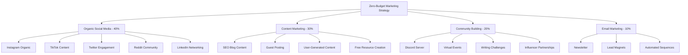
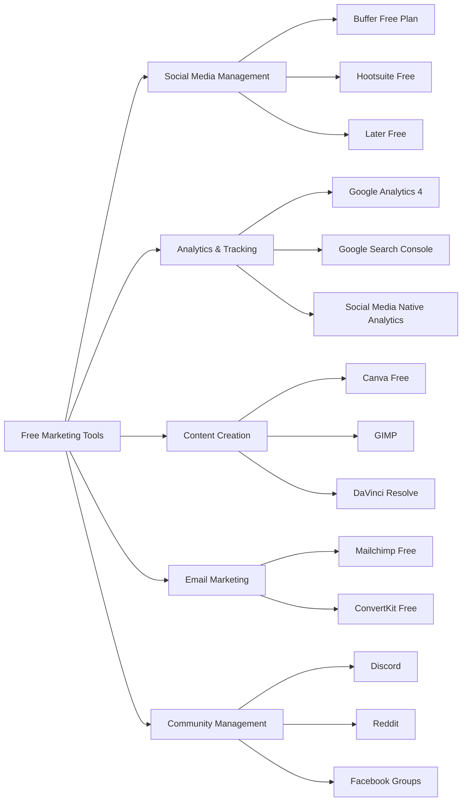

# Marketing Plan Implementation Design

## Overview

This design document outlines a comprehensive zero-budget marketing strategy for our AI-powered storytelling platform. The approach focuses on organic growth, community building, and leveraging free tools to maximize reach and engagement without financial investment. The strategy emphasizes authentic content creation, strategic partnerships, and community-driven growth to build a sustainable marketing foundation.

## Architecture

### Marketing Channel Hierarchy



### Tool Stack Architecture



## Components and Interfaces

### 1. Social Media Management System

**Primary Platforms Strategy:**

**Instagram (Organic Focus)**
- **Content Types**: Carousel posts showcasing writing tips, story development processes, AI assistance examples
- **Posting Schedule**: 5-7 posts weekly, 3-5 Stories daily
- **Engagement Strategy**: Respond to all comments within 2 hours, engage with writing community hashtags
- **Growth Tactics**: Collaborate with micro-influencers through content exchanges, participate in writing challenges

**TikTok (Viral Content Strategy)**
- **Content Types**: 30-60 second tutorials, "Day in the life of a writer using AI", before/after story improvements
- **Posting Schedule**: 5-7 videos weekly
- **Trending Strategy**: Use trending sounds with writing-related content, participate in writing challenges
- **Community Engagement**: Duet with other writing creators, respond to comments with video replies

**Twitter/X (Thought Leadership)**
- **Content Types**: Writing tips threads, AI writing insights, industry commentary, community polls
- **Posting Schedule**: 3-5 tweets daily, 2-3 threads weekly
- **Engagement Strategy**: Join writing Twitter chats, quote tweet with valuable additions, create Twitter Spaces
- **Growth Tactics**: Engage with writing influencers, share user success stories, host Twitter polls

**Reddit (Community Value)**
- **Target Subreddits**: r/writing (2.1M), r/worldbuilding (900k), r/fantasywriters (200k), r/scifiwriting (150k)
- **Content Strategy**: Helpful tutorials, tool recommendations, answering questions (no direct promotion)
- **Engagement Rules**: 90% value-add content, 10% subtle platform mentions
- **Community Building**: Host AMAs, create valuable resources, become trusted community member

### 2. Content Marketing Framework

**SEO-Optimized Blog Strategy**

**Primary Keywords (High Volume, Medium Competition):**
- AI writing assistant (22,000 monthly searches)
- Story generator (18,000 monthly searches)
- Creative writing software (8,100 monthly searches)
- Worldbuilding tools (5,400 monthly searches)
- Character development software (3,600 monthly searches)

**Long-tail Keywords (Lower Competition, High Intent):**
- How to overcome writer's block with AI (1,200 monthly searches)
- Best worldbuilding software for fantasy writers (800 monthly searches)
- AI story generator for beginners (600 monthly searches)
- Free creative writing tools online (2,400 monthly searches)
- Character development worksheet templates (1,800 monthly searches)

**Content Pillars & Editorial Calendar:**

**Pillar 1: Writing Craft (30% of content)**
- "The Complete Guide to Character Development" (3,000 words)
- "10 Plot Structures Every Writer Should Know" (2,500 words)
- "Dialogue Writing: From Boring to Brilliant" (2,000 words)

**Pillar 2: AI Writing Assistance (25% of content)**
- "How AI Can Help Overcome Writer's Block" (2,200 words)
- "Ethical AI Writing: Best Practices for Authors" (1,800 words)
- "AI Prompts for Creative Writing: 50 Ideas to Get Started" (2,800 words)

**Pillar 3: Worldbuilding Guides (25% of content)**
- "Fantasy Worldbuilding: The Ultimate Checklist" (3,500 words)
- "Creating Believable Sci-Fi Worlds" (2,600 words)
- "Worldbuilding Templates and Worksheets" (2,000 words)

**Pillar 4: User Success Stories (10% of content)**
- "From Blank Page to Published Novel: Sarah's AI Writing Journey"
- "How John Built His Fantasy World in 30 Days"

**Pillar 5: Industry Insights (10% of content)**
- "The Future of AI in Creative Writing"
- "Publishing Trends Every Writer Should Know"

### 3. Community Building Architecture

**Discord Server Structure:**

```
📚 WELCOME
├── 📋 rules-and-info
├── 👋 introductions
└── 📢 announcements

✍️ WRITING ZONES
├── 💡 writing-prompts
├── 📝 work-in-progress
├── 🔄 feedback-exchange
└── 🎯 writing-challenges

🤖 AI ASSISTANCE
├── 💬 ai-writing-tips
├── 🛠️ tool-discussions
└── 🆘 ai-help-desk

🌍 WORLDBUILDING
├── 🗺️ world-showcase
├── 👥 character-gallery
└── 🏰 worldbuilding-resources

🎉 COMMUNITY
├── 💬 general-chat
├── 🎊 celebrations
└── 📚 book-recommendations
```

**Virtual Event Calendar:**
- **Weekly**: Writing Sprint Sessions (Fridays 7 PM EST)
- **Bi-weekly**: AI Writing Workshop (Saturdays 2 PM EST)
- **Monthly**: Community Showcase & Feedback Session
- **Quarterly**: Virtual Writing Conference (Free)

### 4. Email Marketing System

**Lead Magnet Strategy:**

**Primary Lead Magnets:**
1. "The Ultimate Worldbuilding Toolkit" (PDF + Templates)
2. "50 AI Writing Prompts for Every Genre" (PDF)
3. "Character Development Worksheet Bundle" (PDF + Notion Template)
4. "The Writer's Guide to AI Tools" (PDF + Video Series)

**Email Sequence Architecture:**

**Welcome Series (7 emails over 14 days):**
1. Day 0: Welcome + Worldbuilding Toolkit delivery
2. Day 2: Platform tour + Getting started guide
3. Day 5: Success story + Community invitation
4. Day 8: AI writing tips + Feature spotlight
5. Day 11: Worldbuilding masterclass + Templates
6. Day 14: Community challenges + Next steps

**Weekly Newsletter Structure:**
- Writing tip of the week
- AI tool spotlight
- Community highlight
- User success story
- Upcoming events
- Resource recommendation

### 5. Analytics and Measurement Framework

**Google Analytics 4 Setup:**

**Custom Events:**
- Newsletter signup
- Discord join
- Resource download
- Blog engagement (time on page >3 minutes)
- Social media click-through
- Community participation

**Conversion Goals:**
- Primary: Platform registration
- Secondary: Discord community join
- Tertiary: Newsletter subscription
- Quaternary: Resource download

**Key Performance Indicators:**

**Acquisition Metrics:**
- Organic traffic growth (month-over-month)
- Social media follower growth rate
- Email list growth rate
- Community member growth
- Referral traffic from partnerships

**Engagement Metrics:**
- Social media engagement rate (likes, comments, shares)
- Email open rate (target: >25%)
- Email click-through rate (target: >3%)
- Blog average session duration (target: >3 minutes)
- Discord daily active users

**Retention Metrics:**
- Email subscriber retention (90-day)
- Community member activity rate
- Blog returning visitor percentage
- Social media follower retention

## Data Models

### Content Calendar Data Structure

```json
{
  "contentCalendar": {
    "month": "January 2025",
    "platforms": {
      "instagram": {
        "postsPerWeek": 6,
        "contentTypes": ["carousel", "single_image", "reel"],
        "themes": ["writing_tips", "ai_assistance", "user_stories"]
      },
      "tiktok": {
        "postsPerWeek": 5,
        "contentTypes": ["tutorial", "before_after", "trending"],
        "duration": "30-60 seconds"
      },
      "blog": {
        "postsPerWeek": 2,
        "wordCount": "2000-3000",
        "seoKeywords": ["primary", "secondary", "long_tail"]
      }
    }
  }
}
```

### User Journey Mapping

```json
{
  "userJourney": {
    "awareness": {
      "touchpoints": ["social_media", "blog_content", "community_mentions"],
      "content": ["educational", "entertaining", "inspiring"],
      "metrics": ["reach", "impressions", "engagement"]
    },
    "consideration": {
      "touchpoints": ["lead_magnets", "email_sequences", "community_participation"],
      "content": ["detailed_guides", "case_studies", "free_resources"],
      "metrics": ["email_signups", "resource_downloads", "community_joins"]
    },
    "conversion": {
      "touchpoints": ["platform_trial", "onboarding", "feature_discovery"],
      "content": ["tutorials", "success_stories", "support"],
      "metrics": ["registrations", "feature_adoption", "retention"]
    }
  }
}
```

## Error Handling

### Social Media Management
- **Content Approval Workflow**: All content reviewed before scheduling
- **Crisis Management Protocol**: Response templates for negative feedback
- **Platform Policy Compliance**: Regular review of platform guidelines
- **Backup Content Strategy**: Emergency content bank for consistent posting

### Community Management
- **Moderation Guidelines**: Clear rules and enforcement procedures
- **Conflict Resolution**: Escalation procedures for community disputes
- **Spam Prevention**: Automated and manual spam detection
- **Member Support**: Help desk system for community questions

### Email Marketing
- **Deliverability Monitoring**: Regular check of sender reputation
- **List Hygiene**: Automated removal of inactive subscribers
- **Compliance Management**: GDPR and CAN-SPAM compliance procedures
- **A/B Testing Framework**: Systematic testing of subject lines and content

## Testing Strategy

### Content Performance Testing
- **A/B Testing**: Headlines, images, posting times, content formats
- **Engagement Analysis**: Track which content types generate highest engagement
- **Conversion Tracking**: Monitor which content drives most signups
- **Platform Optimization**: Test different approaches per platform

### Community Growth Testing
- **Event Format Testing**: Compare workshop formats, timing, topics
- **Engagement Tactics**: Test different community challenges and incentives
- **Onboarding Optimization**: Test different welcome sequences
- **Retention Strategies**: Test various community engagement approaches

### SEO and Content Testing
- **Keyword Performance**: Monitor ranking improvements for target keywords
- **Content Format Testing**: Compare long-form vs. short-form content performance
- **Internal Linking**: Test different linking strategies for SEO
- **User Experience**: Test different content layouts and structures

## Implementation Phases

### Phase 1: Foundation (Month 1-2)
**Week 1-2: Account Setup & Tool Configuration**
- Create and optimize all social media profiles
- Set up Google Analytics 4 with custom events
- Configure free email marketing platform
- Design brand templates in Canva

**Week 3-4: Content Creation Sprint**
- Develop 30-day content calendar
- Create first 10 blog articles
- Design lead magnets and opt-in forms
- Set up Discord server structure

**Week 5-8: Community Seeding**
- Launch Discord with founding members
- Begin daily social media posting
- Publish 2x weekly blog content
- Start email welcome sequence

### Phase 2: Growth Acceleration (Month 3-4)
**Week 9-12: Engagement Optimization**
- Analyze first month's performance data
- Optimize posting times and content types
- Launch first virtual writing workshop
- Begin guest posting outreach

**Week 13-16: Community Expansion**
- Implement referral program for Discord
- Launch writing challenges and contests
- Start influencer collaboration outreach
- Expand to additional social platforms

### Phase 3: Scale and Optimize (Month 5-6)
**Week 17-20: Performance Analysis**
- Comprehensive analytics review
- Identify top-performing content and channels
- Scale successful strategies
- Eliminate underperforming tactics

**Week 21-24: Advanced Strategies**
- Launch affiliate program for power users
- Implement advanced email segmentation
- Create evergreen content systems
- Plan quarterly virtual summit

This design provides a comprehensive framework for implementing a zero-budget marketing strategy that leverages organic growth, community building, and strategic content creation to build a sustainable marketing foundation for the AI-powered storytelling platform.