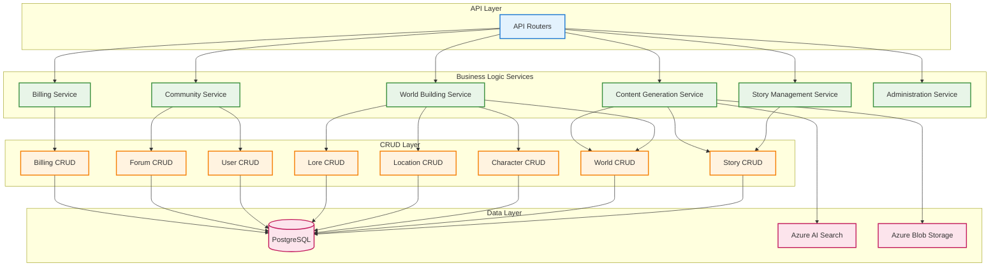
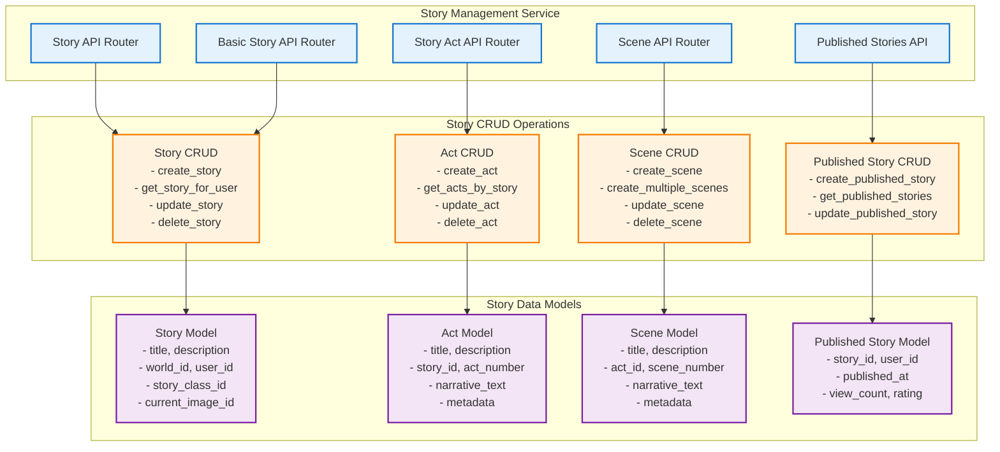
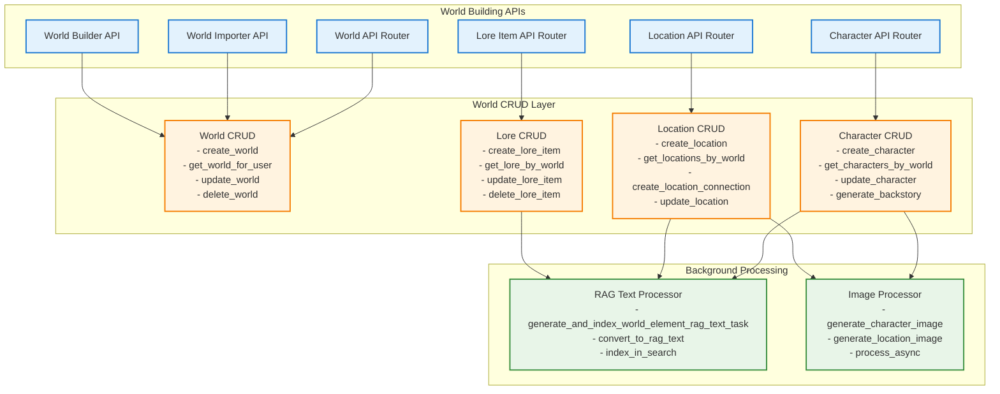
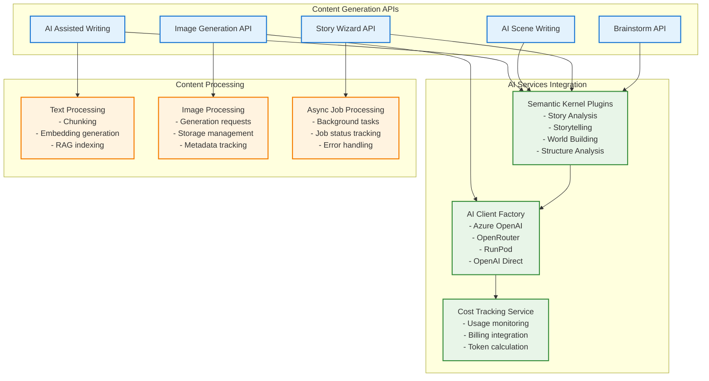
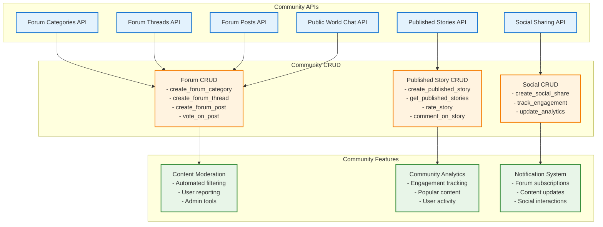

# Business Logic Layer and Service Boundaries

## Table of Contents
- [Business Logic Architecture](#business-logic-architecture)
- [Story Management System](#story-management-system)
- [World Building System](#world-building-system)
- [Content Generation Services](#content-generation-services)
- [Community Features](#community-features)
- [Billing and Administration](#billing-and-administration)
- [Service Boundaries and Integration](#service-boundaries-and-integration)

## Business Logic Architecture

The business logic layer implements the core domain functionality of the storytelling platform, organized into distinct service boundaries with clear responsibilities and well-defined interfaces.

### Service Architecture Overview



### Service Design Principles

#### Domain-Driven Design
- **Bounded Contexts**: Each service represents a distinct business domain
- **Aggregate Roots**: Clear entity hierarchies and ownership
- **Domain Events**: Asynchronous communication between services
- **Ubiquitous Language**: Consistent terminology across service boundaries

#### Service Responsibilities
- **Single Responsibility**: Each service has one primary business purpose
- **High Cohesion**: Related functionality grouped together
- **Loose Coupling**: Minimal dependencies between services
- **Interface Segregation**: Clean, focused service interfaces

## Story Management System

### Service Boundaries

The Story Management System handles all aspects of story creation, organization, and lifecycle management.

#### Core Responsibilities
- **Story CRUD Operations**: Create, read, update, delete stories
- **Story Structure Management**: Acts, scenes, and narrative organization
- **Story Publishing**: Public story sharing and distribution
- **Story Associations**: Links to world elements (characters, locations, lore)
- **Story Metadata**: Tags, categories, and classification

### Story Service Architecture



### Story Management Patterns

#### Story Creation Flow
```python
async def create_story(db: AsyncSession, story: StoryCreate, user_id: int) -> Story:
    logger.info(f"User ID {user_id} creating new story: '{story.title}', linking to world_id: {story.world_id}")
    db_story = Story(**story.model_dump(), user_id=user_id)
    db.add(db_story)
    await db.flush()
    await db.refresh(db_story, attribute_names=['OwnerUser', 'world', 'published_version'])
    return db_story
```

#### Hierarchical Structure Management
- **Story → Acts → Scenes**: Three-level hierarchy with automatic numbering
- **Association Management**: Links to world elements through association tables
- **Metadata Tracking**: Creation timestamps, modification history, user ownership

#### Story Publishing Workflow
1. **Content Validation**: Ensure story meets publishing requirements
2. **File Generation**: Create downloadable formats (PDF, EPUB)
3. **Blob Storage**: Upload generated files to Azure Blob Storage
4. **Public Index**: Add to published stories catalog
5. **Analytics Tracking**: Monitor views, ratings, and engagement

## World Building System

### Service Architecture

The World Building System manages the creation and organization of fictional universes with their constituent elements.

#### Core Components
- **World Management**: World creation, settings, and organization
- **Character System**: Character profiles, relationships, and development
- **Location System**: Geographic and spatial organization
- **Lore Management**: History, mythology, and world knowledge
- **World Associations**: Cross-references between world elements

### World Service Components



### World Building Patterns

#### World Element Creation Pattern
```python
async def create_character(
    db: AsyncSession, 
    character_in: CharacterCreate, 
    world_id: int,
    user_id: int, 
    background_tasks: BackgroundTasks,
    model_config_id: Optional[int] = None
) -> Character:
    # Create character entity
    db_character = Character(**character_in.model_dump(), world_id=world_id)
    db.add(db_character)
    await db.flush()
    await db.commit()
    
    # Schedule background processing
    background_tasks.add_task(
        generate_and_index_world_element_rag_text_task,
        character_id=db_character.id,
        model_config_id=model_config_id
    )
    
    return db_character
```

#### Background Processing Integration
- **RAG Text Generation**: Convert world elements to searchable text
- **Vector Indexing**: Add to AI search index for RAG operations
- **Image Generation**: Create visual representations asynchronously
- **Cross-Reference Updates**: Update related elements and associations

## Content Generation Services

### AI-Powered Content Creation

The Content Generation Services provide AI-assisted writing and creative tools throughout the platform.

#### Service Components
- **AI Assisted Writing**: Real-time writing assistance and suggestions
- **Scene Writing**: AI-powered scene generation and enhancement
- **Story Wizard**: Guided story creation with AI assistance
- **Image Generation**: Visual content creation for stories and worlds
- **Brainstorm Service**: Creative ideation and concept development

### Content Generation Architecture



### Content Generation Patterns

#### AI-Assisted Writing Flow
1. **Context Gathering**: Collect relevant story/world context
2. **RAG Retrieval**: Find relevant background information
3. **Prompt Construction**: Build context-aware prompts
4. **AI Generation**: Generate content using appropriate model
5. **Post-Processing**: Format and validate generated content
6. **Cost Tracking**: Log usage and update user balance

#### Async Content Generation
```python
# Background task pattern for long-running operations
background_tasks.add_task(
    generate_and_process_content,
    content_type="character_backstory",
    entity_id=character.id,
    user_id=current_user.id,
    model_config_id=model_config.id
)
```

## Community Features

### Forum and Social System

The Community Features provide social interaction, discussion, and content sharing capabilities.

#### Core Components
- **Forum System**: Categories, threads, and posts
- **User Profiles**: Public profiles and activity tracking
- **Content Sharing**: Story publishing and discovery
- **Social Features**: Ratings, comments, and favorites
- **Moderation Tools**: Content moderation and user management

### Community Service Architecture



## Billing and Administration

### Billing Service Architecture

The Billing Service manages user accounts, credits, transactions, and usage tracking.

#### Core Responsibilities
- **User Account Management**: Credit balances and account status
- **Transaction Processing**: Credit purchases and usage deductions
- **Cost Tracking**: AI usage monitoring and billing
- **Package Management**: Credit packages and pricing
- **Admin Tools**: Billing administration and reporting

### Billing Service Components

```python
class BillingService:
    """Comprehensive billing service for user account and transaction management."""
    
    async def get_or_create_user_account(self, db: AsyncSession, user_id: int) -> UserAccount:
        """Get existing account or create new one with default balance."""
        
    async def create_transaction(self, db: AsyncSession, transaction_data: UserTransactionCreate) -> UserTransaction:
        """Create transaction and update account balance."""
        
    async def deduct_credits(self, db: AsyncSession, user_id: int, amount: float, description: str) -> bool:
        """Deduct credits from user account with validation."""
        
    async def get_user_balance(self, db: AsyncSession, user_id: int) -> float:
        """Get current user credit balance."""
```

### Administrative Services

#### Admin Service Boundaries
- **User Management**: Account administration and user support
- **Content Moderation**: Content review and policy enforcement
- **System Monitoring**: Performance metrics and health checks
- **Billing Administration**: Transaction management and reporting
- **Maintenance Tools**: System maintenance and configuration

## Service Boundaries and Integration

### Inter-Service Communication Patterns

#### Direct Database Access
```python
# Services access data through CRUD layer
story_service = StoryService()
world_service = WorldService()

# Story service can access world data for validation
world = await world_service.get_world_for_user(db, world_id, user_id)
if world:
    story = await story_service.create_story(db, story_data, user_id)
```

#### Event-Driven Integration
```python
# Background tasks for async processing
background_tasks.add_task(
    update_related_content,
    entity_type="character",
    entity_id=character.id,
    change_type="created"
)
```

#### Shared Utilities and Dependencies
- **Authentication**: Shared user authentication across all services
- **Database Sessions**: Common database session management
- **Error Handling**: Consistent error handling patterns
- **Logging**: Centralized logging and monitoring
- **Configuration**: Shared configuration management

### Service Integration Principles

#### Loose Coupling
- Services communicate through well-defined interfaces
- Minimal direct dependencies between service implementations
- Async processing for non-critical cross-service operations

#### Data Consistency
- Transactional boundaries within individual services
- Eventual consistency for cross-service operations
- Compensation patterns for distributed transactions

#### Error Isolation
- Service failures don't cascade to other services
- Graceful degradation when dependencies are unavailable
- Circuit breaker patterns for external service calls

---
**Document Information:**
- Last Updated: 2025-07-14
- Version: 1.0.0
- Author: Architecture Team
- Reviewers: Business Logic Team