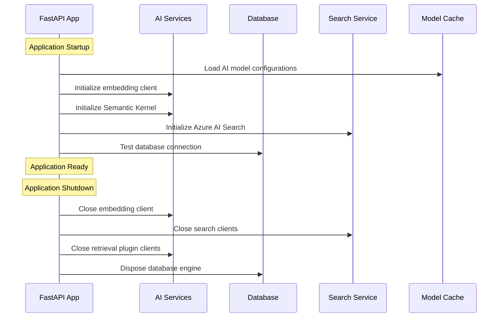
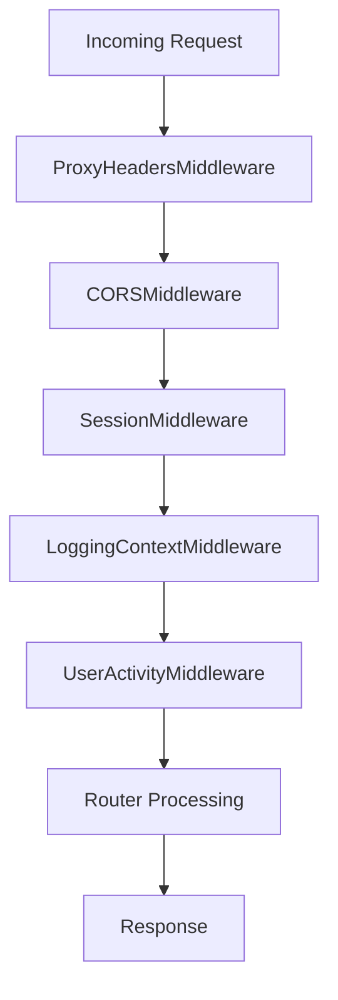
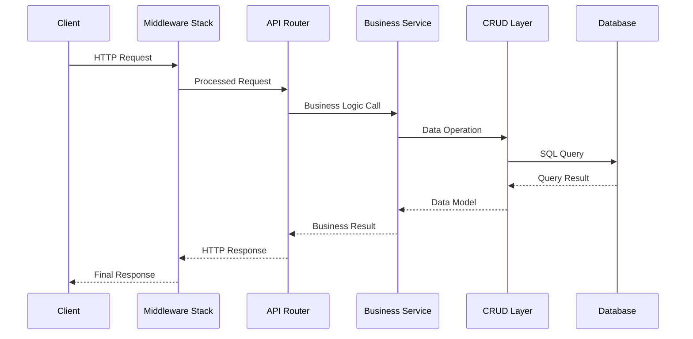

# Core Application Components and Interfaces

## Table of Contents
- [FastAPI Application Structure](#fastapi-application-structure)
- [Authentication System](#authentication-system)
- [API Router Organization](#api-router-organization)
- [Middleware Stack](#middleware-stack)
- [Component Interaction Patterns](#component-interaction-patterns)
- [Service Dependencies](#service-dependencies)

## FastAPI Application Structure

### Main Application (`app/main.py`)

The FastAPI application serves as the central orchestrator for the entire platform, managing application lifecycle, middleware configuration, and service initialization.

#### Key Responsibilities
- **Application Lifecycle Management**: Startup and shutdown sequences
- **Service Initialization**: AI services, database connections, search services
- **Middleware Configuration**: Security, logging, CORS, and request processing
- **Router Registration**: API and UI route organization
- **Static File Serving**: Frontend assets and documentation

#### Application Lifecycle Flow



#### Configuration Management
```python
# Core configuration pattern
from app.core.config import settings

app = FastAPI(
    title=settings.APP_PROJECT_NAME,
    openapi_url=f"{settings.API_V1_STR}/openapi.json" if settings.APP_ENV.lower() != "production" else None,
    docs_url="/docs" if settings.APP_ENV.lower() != "production" else None,
    lifespan=lifespan
)
```

### Configuration System (`app/core/config.py`)

Centralized configuration management using Pydantic settings with environment variable support.

#### Configuration Categories
- **Application Settings**: Project name, environment, API versioning
- **Database Configuration**: PostgreSQL connection parameters
- **Authentication Settings**: JWT secrets, OAuth configuration
- **AI Service Configuration**: Azure OpenAI, OpenRouter, RunPod settings
- **Storage Configuration**: Azure Blob Storage containers
- **Feature Flags**: Optional feature enablement

## Authentication System

### Authentication Architecture

```mermaid
graph TB
    subgraph "Authentication Flow"
        LOGIN[Login Request]
        VALIDATE[Credential Validation]
        JWT[JWT Token Generation]
        RESPONSE[Authentication Response]
    end
    
    subgraph "OAuth Flow"
        OAUTH_START[OAuth Initiation]
        PROVIDER[OAuth Provider]
        CALLBACK[OAuth Callback]
        USER_CREATE[User Creation/Login]
    end
    
    subgraph "Authorization"
        TOKEN_VALIDATE[Token Validation]
        USER_LOOKUP[User Lookup]
        PERMISSION_CHECK[Permission Check]
        ACCESS_GRANT[Access Granted]
    end
    
    LOGIN --> VALIDATE
    VALIDATE --> JWT
    JWT --> RESPONSE
    
    OAUTH_START --> PROVIDER
    PROVIDER --> CALLBACK
    CALLBACK --> USER_CREATE
    
    TOKEN_VALIDATE --> USER_LOOKUP
    USER_LOOKUP --> PERMISSION_CHECK
    PERMISSION_CHECK --> ACCESS_GRANT
```



### Authentication Components

#### JWT Authentication (`app/routers/auth.py`)
- **User Registration**: Account creation with terms acceptance
- **User Login**: Credential validation and token generation
- **Password Management**: Secure password hashing with Argon2
- **Token Management**: JWT token creation and validation

#### OAuth Integration (`app/routers/oauth.py`)
- **Google OAuth**: Social authentication integration
- **Session Management**: Secure session handling
- **User Mapping**: OAuth profile to local user account mapping

#### Security Middleware
- **Authentication Middleware**: Token validation on protected routes
- **CORS Middleware**: Cross-origin request handling
- **Session Middleware**: OAuth session management
- **User Activity Middleware**: Request logging and monitoring

## API Router Organization

### Router Categories

#### Core API Routers (`/api/v1/`)
- **Authentication** (`/auth`): User authentication and OAuth
- **Users** (`/users`): User profile management
- **Stories** (`/stories`): Story CRUD operations
- **Worlds** (`/worlds`): World building and management
- **Characters** (`/characters`): Character management
- **Locations** (`/locations`): Location management
- **Lore Items** (`/lore-items`): Lore and mythology management

#### Content Management Routers
- **Documents** (`/documents`): File upload and management
- **Image Generation** (`/generate-image`): AI image creation
- **AI Assisted Writing**: Real-time writing assistance
- **Story Wizard** (`/api/story-wizard`): Guided story creation

#### Community Routers
- **Forum Categories** (`/api/forum/categories`): Discussion organization
- **Forum Threads** (`/api/forum/threads`): Discussion topics
- **Forum Posts** (`/api/forum/posts`): Individual messages
- **Published Stories** (`/published-stories`): Public story sharing

#### Administrative Routers
- **Billing** (`/billing`): Credit and payment management
- **Admin Billing** (`/admin/billing`): Administrative billing tools
- **AI Models** (`/ai-models`): AI model configuration
- **Maintenance** (`/maintenance`): System maintenance tools

#### UI View Routers (`/ui/`)
- **General Views** (`/ui`): Dashboard and general pages
- **Story Views** (`/ui/stories`): Story management interface
- **World Views** (`/ui/worlds`): World building interface
- **Document Views** (`/ui/documents`): Document management interface
- **Admin Views** (`/ui/admin`): Administrative interfaces

### Router Structure Pattern

```python
# Standard router pattern
from fastapi import APIRouter, Depends, HTTPException, status
from sqlalchemy.ext.asyncio import AsyncSession

from app.core.deps import get_db_session, get_current_active_user
from app.schemas import entity_schema
from app.crud import entity_crud

router = APIRouter(
    prefix="/entities",
    tags=["entities"],
    dependencies=[Depends(get_current_active_user)]
)

@router.post("/", response_model=entity_schema.EntityRead)
async def create_entity(
    entity_in: entity_schema.EntityCreate,
    db: AsyncSession = Depends(get_db_session),
    current_user: User = Depends(get_current_active_user)
):
    # Implementation
    pass
```

## Middleware Stack

### Middleware Processing Order



### Middleware Components

#### ProxyHeadersMiddleware
- **Purpose**: Handle X-Forwarded-* headers from load balancers
- **Configuration**: Trusts all hosts (`trusted_hosts="*"`)
- **Use Case**: Azure App Service deployment compatibility

#### CORSMiddleware
- **Purpose**: Cross-Origin Resource Sharing configuration
- **Configuration**: Configurable origins from environment
- **Features**: Credentials support, all methods and headers allowed

#### SessionMiddleware
- **Purpose**: OAuth session management
- **Configuration**: Secure session cookies with 1-hour expiration
- **Security**: Uses AUTH_SECRET_KEY for session encryption

#### LoggingContextMiddleware
- **Purpose**: Request context logging
- **Features**: Request ID generation, context propagation
- **Integration**: Structured logging throughout the application

#### UserActivityMiddleware
- **Purpose**: Comprehensive request logging and monitoring
- **Features**: 
  - Request/response logging with configurable body logging
  - Sensitive field filtering
  - Path and method exclusions
  - Performance metrics collection

## Component Interaction Patterns

### Request Processing Flow



### Dependency Injection Pattern

```python
# Common dependency pattern
from app.core.deps import get_db_session, get_current_active_user

@router.get("/protected-resource")
async def get_protected_resource(
    db: AsyncSession = Depends(get_db_session),
    current_user: User = Depends(get_current_active_user)
):
    # Access to database session and authenticated user
    pass
```

### Error Handling Pattern

```python
# Consistent error handling
try:
    result = await service_operation()
    return result
except ValueError as e:
    logger.warning(f"Validation error: {e}")
    raise HTTPException(
        status_code=status.HTTP_400_BAD_REQUEST,
        detail=str(e)
    )
except Exception as e:
    logger.error(f"Unexpected error: {e}", exc_info=True)
    raise HTTPException(
        status_code=status.HTTP_500_INTERNAL_SERVER_ERROR,
        detail="Internal server error"
    )
```

## Service Dependencies

### Core Dependencies (`app/core/deps.py`)

#### Database Session Management
```python
async def get_db_session() -> AsyncSession:
    """Provide database session with automatic cleanup."""
    async with async_session_local() as session:
        try:
            yield session
        finally:
            await session.close()
```

#### User Authentication
```python
async def get_current_active_user(
    token: str = Depends(oauth2_scheme),
    db: AsyncSession = Depends(get_db_session)
) -> User:
    """Validate JWT token and return current user."""
    # Token validation and user lookup logic
```

### Azure Dependencies (`app/core/azure_deps.py`)

#### Blob Storage Client
```python
async def get_blob_service_client() -> BlobServiceClient:
    """Provide Azure Blob Storage client."""
    # Azure credential and client initialization
```

### Search Service Dependencies (`app/dependencies.py`)

#### AI Search Service
```python
def get_search_service(request: Request) -> AzureAISearchService:
    """Provide Azure AI Search service from application state."""
    # Service validation and retrieval
```

### Shared Dependencies (`app/core/dependencies_shared.py`)

#### World Ownership Verification
```python
async def get_world_and_verify_ownership(
    world_id: int,
    current_user: User = Depends(get_current_active_user),
    db: AsyncSession = Depends(get_db_session)
) -> World:
    """Verify user owns the specified world."""
    # Ownership validation logic
```

### Service Integration Patterns

#### Service Composition
```python
# Multiple service dependencies
@router.post("/complex-operation")
async def complex_operation(
    db: AsyncSession = Depends(get_db_session),
    current_user: User = Depends(get_current_active_user),
    search_service: AzureAISearchService = Depends(get_search_service),
    blob_client: BlobServiceClient = Depends(get_blob_service_client)
):
    # Multi-service operation
    pass
```

#### Conditional Dependencies
```python
# Optional service dependencies
async def get_optional_service():
    if service_enabled:
        return service_instance
    return None

@router.get("/feature")
async def feature_endpoint(
    service: Optional[Service] = Depends(get_optional_service)
):
    if service:
        # Enhanced functionality
        pass
    else:
        # Basic functionality
        pass
```

---
**Document Information:**
- Last Updated: 2025-07-14
- Version: 1.0.0
- Author: Architecture Team
- Reviewers: Technical Leads