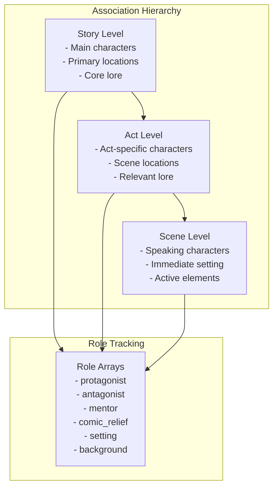
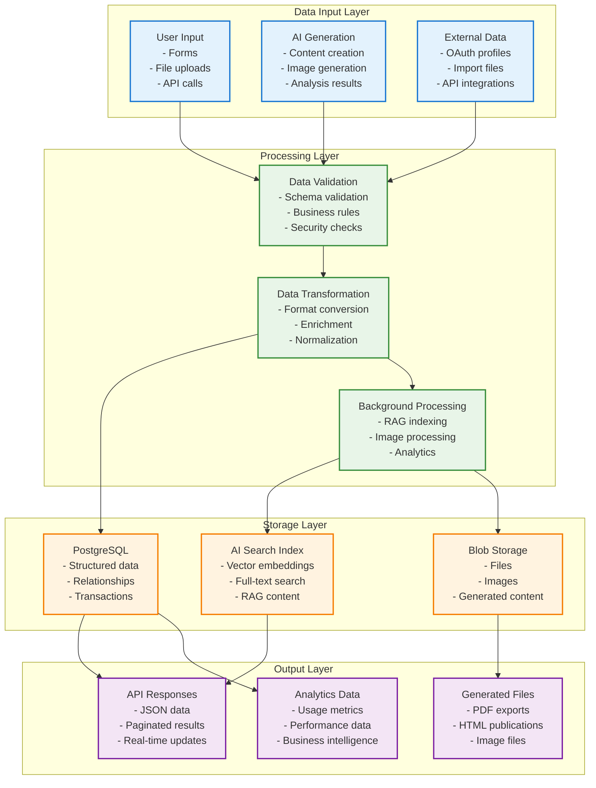

# Data Architecture Documentation

## Table of Contents
- [Database Overview](#database-overview)
- [Entity Relationship Model](#entity-relationship-model)
- [Core Domain Entities](#core-domain-entities)
- [Association and Junction Tables](#association-and-junction-tables)
- [Data Access Patterns](#data-access-patterns)
- [Database Schema Evolution](#database-schema-evolution)
- [Data Flow and Processing](#data-flow-and-processing)

## Database Overview

The storytelling platform uses PostgreSQL as its primary relational database, designed to support complex hierarchical content structures, user-generated content, and AI-powered features with comprehensive audit trails and analytics capabilities.

### Database Architecture Principles

#### Relational Design
- **Normalized Structure**: Third normal form with strategic denormalization for performance
- **Referential Integrity**: Foreign key constraints ensure data consistency
- **Cascade Policies**: Appropriate cascade delete and update policies
- **Indexing Strategy**: Optimized indexes for query performance

#### Scalability Considerations
- **Connection Pooling**: Async connection pool management
- **Query Optimization**: Efficient query patterns and eager loading
- **Partitioning Ready**: Schema designed for future horizontal partitioning
- **Audit Trail**: Comprehensive tracking of data changes

## Entity Relationship Model

### Complete Entity Relationship Diagram

```mermaid
erDiagram
    %% Core User and Authentication
    User ||--o{ World : owns
    User ||--o{ Story : creates
    User ||--o{ UserAccount : has
    User ||--o{ UserTransaction : performs
    User ||--o{ UserActivity : generates
    User ||--o{ AICallLog : triggers
    
    %% World Building Entities
    World ||--o{ Character : contains
    World ||--o{ Location : contains
    World ||--o{ LoreItem : contains
    World ||--o{ StoryClass : defines
    World ||--o{ ChatSession : enables
    World ||--o{ WorldRole : customizes
    
    %% Story Structure
    Story ||--o{ Act : structured_as
    Act ||--o{ Scene : contains
    Story }o--|| World : belongs_to
    
    %% Content Associations
    Story ||--o{ StoryCharacterAssociation : features
    Story ||--o{ StoryLocationAssociation : uses
    Story ||--o{ StoryLoreItemAssociation : references
    
    Act ||--o{ ActCharacterAssociation : features
    Act ||--o{ ActLocationAssociation : uses
    Act ||--o{ ActLoreItemAssociation : references
    
    Scene ||--o{ SceneCharacterAssociation : features
    Scene ||--o{ SceneLocationAssociation : uses
    Scene ||--o{ SceneLoreItemAssociation : references
    
    %% Association Targets
    StoryCharacterAssociation }o--|| Character : targets
    StoryLocationAssociation }o--|| Location : targets
    StoryLoreItemAssociation }o--|| LoreItem : targets
    
    ActCharacterAssociation }o--|| Character : targets
    ActLocationAssociation }o--|| Location : targets
    ActLoreItemAssociation }o--|| LoreItem : targets
    
    SceneCharacterAssociation }o--|| Character : targets
    SceneLocationAssociation }o--|| Location : targets
    SceneLoreItemAssociation }o--|| LoreItem : targets
    
    %% Location Relationships
    Location ||--o{ LocationConnection : connects_from
    Location ||--o{ LocationConnection : connects_to
    Location ||--o{ Character : houses
    
    %% Generated Content
    User ||--o{ GeneratedImage : requests
    GeneratedImage }o--|| AICallLog : tracked_by
    World ||--o{ GeneratedImage : displays
    Story ||--o{ GeneratedImage : displays
    Character ||--o{ GeneratedImage : displays
    Location ||--o{ GeneratedImage : displays
    
    %% Document Management
    User ||--o{ UploadedDocument : uploads
    UploadedDocument }o--|| World : belongs_to
    
    %% Community Features
    User ||--o{ ForumThread : creates
    ForumThread ||--o{ ForumPost : contains
    User ||--o{ ForumPost : authors
    User ||--o{ ForumVote : casts
    ForumPost ||--o{ ForumVote : receives
    User ||--o{ ForumSubscription : subscribes
    ForumThread ||--o{ ForumSubscription : tracked_by
    
    %% Publishing and Social
    Story ||--o{ PublishedStory : published_as
    User ||--o{ StoryComment : writes
    User ||--o{ StoryRating : rates
    PublishedStory ||--o{ StoryComment : receives
    PublishedStory ||--o{ StoryRating : receives
    User ||--o{ SocialShare : shares
    
    %% Chat and AI Interaction
    User ||--o{ ChatSession : initiates
    World ||--o{ ChatSession : enables
    ChatSession ||--o{ ChatMessage : contains
    User ||--o{ StoryChatSession : initiates
    Story ||--o{ StoryChatSession : enables
    StoryChatSession ||--o{ StoryChatMessage : contains
    
    %% AI and Billing
    User ||--o{ AICallLog : generates
    AICallLog }o--|| AIModelConfiguration : uses
    UserAccount ||--o{ UserTransaction : records
    User ||--o{ CreditPackage : purchases
    
    %% Background Processing
    User ||--o{ JobStatus : triggers
    User ||--o{ BrainstormSession : creates
    BrainstormSession ||--o{ BrainstormStory : generates
    User ||--o{ BrainstormFavorite : saves
```



### Database Schema Statistics

| Category | Tables | Key Relationships |
|----------|--------|-------------------|
| **Core Entities** | 8 | User, World, Story, Character, Location, LoreItem, Act, Scene |
| **Association Tables** | 9 | Story/Act/Scene associations with world elements |
| **Community Features** | 8 | Forum, comments, ratings, social sharing |
| **AI & Content** | 6 | AI models, cost tracking, generated images |
| **System & Admin** | 7 | User accounts, transactions, job status |
| **Total Tables** | **38** | **Complex many-to-many relationships** |

## Core Domain Entities

### User Management Domain

#### User Entity (`users`)
```sql
CREATE TABLE users (
    id SERIAL PRIMARY KEY,
    username VARCHAR(100) UNIQUE NOT NULL,
    email VARCHAR(255) UNIQUE,
    hashed_password VARCHAR,
    display_name VARCHAR(100),
    
    -- OAuth Integration
    auth_provider VARCHAR(50) DEFAULT 'local',
    provider_id VARCHAR(255) UNIQUE,
    provider_data JSON DEFAULT '{}',
    profile_picture_url VARCHAR(500),
    
    -- Status and Permissions
    is_active BOOLEAN DEFAULT FALSE,
    is_admin BOOLEAN DEFAULT FALSE,
    
    -- Onboarding and Rewards
    interview_data JSON,
    bonus1 BOOLEAN DEFAULT FALSE, -- Intro Interview (150 coins)
    bonus2 BOOLEAN DEFAULT FALSE, -- Story Brainstorm (50 coins)
    bonus3 BOOLEAN DEFAULT FALSE, -- Start Writing (50 coins)
    -- ... bonus4-10 for future features
    
    created_at TIMESTAMP WITH TIME ZONE DEFAULT NOW(),
    updated_at TIMESTAMP WITH TIME ZONE DEFAULT NOW()
);
```

#### User Account Entity (`user_accounts`)
```sql
CREATE TABLE user_accounts (
    id SERIAL PRIMARY KEY,
    user_id INTEGER REFERENCES users(id) ON DELETE CASCADE,
    balance_coins DECIMAL(10,2) DEFAULT 0.00,
    total_earned_coins DECIMAL(10,2) DEFAULT 0.00,
    total_spent_coins DECIMAL(10,2) DEFAULT 0.00,
    created_at TIMESTAMP WITH TIME ZONE DEFAULT NOW(),
    updated_at TIMESTAMP WITH TIME ZONE DEFAULT NOW()
);
```

### World Building Domain

#### World Entity (`worlds`)
```sql
CREATE TABLE worlds (
    id SERIAL PRIMARY KEY,
    name VARCHAR(255) NOT NULL,
    description TEXT,
    short_description TEXT,
    world_builder_data JSON,
    user_id INTEGER REFERENCES users(id) ON DELETE CASCADE,
    
    -- Image Support
    image_prompt_definition TEXT,
    image_blob_path VARCHAR(1024),
    current_image_id INTEGER REFERENCES generated_images(id) ON DELETE SET NULL,
    
    -- Access Control
    is_free_chat_enabled BOOLEAN DEFAULT FALSE,
    is_shadow BOOLEAN DEFAULT FALSE, -- For Basic Stories
    
    created_at TIMESTAMP WITH TIME ZONE DEFAULT NOW(),
    updated_at TIMESTAMP WITH TIME ZONE DEFAULT NOW()
);
```

#### Character Entity (`characters`)
```sql
CREATE TABLE characters (
    id SERIAL PRIMARY KEY,
    name VARCHAR(255) NOT NULL,
    gender VARCHAR(50),
    species VARCHAR(100),
    description TEXT,
    personality_traits TEXT,
    backstory TEXT,
    
    -- Image and Visual
    image_prompt_definition TEXT,
    image_blob_path VARCHAR(1024),
    current_image_id INTEGER REFERENCES generated_images(id) ON DELETE SET NULL,
    
    -- World Relationship
    world_id INTEGER REFERENCES worlds(id) ON DELETE CASCADE,
    current_location_id INTEGER REFERENCES locations(id) ON DELETE SET NULL,
    placement_note TEXT,
    
    -- AI Generation Metadata
    importance_rating INTEGER,
    relationships TEXT,
    core_motivations JSON,
    physical_attributes JSON,
    key_relationships JSON,
    genre VARCHAR(100),
    genre_specific_answers JSON,
    generated_narrative TEXT,
    is_ai_generated BOOLEAN DEFAULT FALSE,
    
    -- Character Development
    next_quest_scenario TEXT,
    first_meeting_message TEXT,
    age_category VARCHAR(50),
    profession VARCHAR(100),
    short_backstory TEXT,
    visual_prompt TEXT,
    narrative_filter_results JSON,
    
    created_at TIMESTAMP WITH TIME ZONE DEFAULT NOW(),
    updated_at TIMESTAMP WITH TIME ZONE DEFAULT NOW()
);
```

### Story Structure Domain

#### Story Entity (`stories`)
```sql
CREATE TABLE stories (
    id SERIAL PRIMARY KEY,
    title VARCHAR(255) NOT NULL,
    short_description TEXT, -- Writer's intent/summary
    ai_summary TEXT, -- AI-generated summary
    user_id INTEGER REFERENCES users(id) ON DELETE CASCADE,
    world_id INTEGER REFERENCES worlds(id) ON DELETE RESTRICT,
    
    -- Story Classification
    story_type VARCHAR(20) DEFAULT 'advanced', -- 'basic' or 'advanced'
    story_genre VARCHAR(100),
    story_tone VARCHAR(100),
    primary_conflict_type VARCHAR(100),
    
    -- Image Support
    image_prompt_definition TEXT,
    image_blob_path VARCHAR(1024),
    current_image_id INTEGER REFERENCES generated_images(id) ON DELETE SET NULL,
    
    created_at TIMESTAMP WITH TIME ZONE DEFAULT NOW(),
    updated_at TIMESTAMP WITH TIME ZONE DEFAULT NOW()
);
```

#### Act Entity (`acts`)
```sql
CREATE TABLE acts (
    id SERIAL PRIMARY KEY,
    title VARCHAR(255) NOT NULL,
    description TEXT,
    story_id INTEGER REFERENCES stories(id) ON DELETE CASCADE,
    act_number INTEGER NOT NULL,
    
    -- Content
    narrative_text TEXT,
    act_summary TEXT, -- Writer's intent
    ai_summary TEXT, -- AI-generated summary
    
    -- Image Support
    image_prompt_definition TEXT,
    image_blob_path VARCHAR(1024),
    current_image_id INTEGER REFERENCES generated_images(id) ON DELETE SET NULL,
    
    created_at TIMESTAMP WITH TIME ZONE DEFAULT NOW(),
    updated_at TIMESTAMP WITH TIME ZONE DEFAULT NOW(),
    
    UNIQUE(story_id, act_number)
);
```

## Association and Junction Tables

### Story-World Element Associations

The platform uses a sophisticated association system that tracks not just relationships but also the roles that world elements play in different contexts.

#### Story Character Association
```sql
CREATE TABLE story_character_associations (
    id SERIAL PRIMARY KEY,
    story_id INTEGER REFERENCES stories(id) ON DELETE CASCADE,
    character_id INTEGER REFERENCES characters(id) ON DELETE CASCADE,
    roles TEXT[], -- Array of roles: ['protagonist', 'mentor', 'antagonist']
    created_at TIMESTAMP WITH TIME ZONE DEFAULT NOW(),
    
    UNIQUE(story_id, character_id)
);
```

#### Multi-Level Association Pattern


### Location Connection System

#### Location Connections (`location_connections`)
```sql
CREATE TABLE location_connections (
    from_location_id INTEGER REFERENCES locations(id) ON DELETE CASCADE,
    to_location_id INTEGER REFERENCES locations(id) ON DELETE CASCADE,
    connection_type VARCHAR(100), -- 'north', 'portal', 'hidden_passage'
    description TEXT,
    is_bidirectional BOOLEAN DEFAULT TRUE,
    travel_time_minutes INTEGER,
    difficulty_level VARCHAR(50),
    
    PRIMARY KEY (from_location_id, to_location_id)
);
```

## Data Access Patterns

### Repository Pattern Implementation

#### Base CRUD Pattern
```python
# Standard CRUD operations pattern
async def create_entity(db: AsyncSession, entity_in: EntityCreate, **kwargs) -> Entity:
    """Create new entity with proper relationship handling."""
    db_entity = Entity(**entity_in.model_dump(), **kwargs)
    db.add(db_entity)
    await db.flush()
    await db.refresh(db_entity, attribute_names=['relationships'])
    return db_entity

async def get_entity_for_user(db: AsyncSession, entity_id: int, user_id: int) -> Optional[Entity]:
    """Get entity with user ownership validation."""
    result = await db.execute(
        select(Entity)
        .filter(Entity.id == entity_id, Entity.user_id == user_id)
        .options(selectinload(Entity.related_entities))
    )
    return result.scalars().first()
```

#### Eager Loading Strategy
```python
# Optimized relationship loading
async def get_story_with_full_structure(db: AsyncSession, story_id: int) -> Optional[Story]:
    """Load story with complete hierarchical structure."""
    result = await db.execute(
        select(Story)
        .filter(Story.id == story_id)
        .options(
            selectinload(Story.world),
            selectinload(Story.acts).selectinload(Act.scenes),
            selectinload(Story.character_associations).selectinload(StoryCharacterAssociation.character),
            selectinload(Story.location_associations).selectinload(StoryLocationAssociation.location),
            selectinload(Story.lore_item_associations).selectinload(StoryLoreItemAssociation.lore_item)
        )
    )
    return result.scalars().first()
```

### Query Optimization Patterns

#### Pagination with Counting
```python
async def get_paginated_entities(
    db: AsyncSession, 
    user_id: int, 
    skip: int = 0, 
    limit: int = 100
) -> Tuple[List[Entity], int]:
    """Get paginated results with total count."""
    # Get total count
    count_result = await db.execute(
        select(func.count(Entity.id)).filter(Entity.user_id == user_id)
    )
    total_count = count_result.scalar()
    
    # Get paginated results
    result = await db.execute(
        select(Entity)
        .filter(Entity.user_id == user_id)
        .order_by(Entity.created_at.desc())
        .offset(skip)
        .limit(limit)
    )
    entities = result.scalars().all()
    
    return entities, total_count
```

#### Complex Association Queries
```python
async def get_characters_with_story_roles(db: AsyncSession, story_id: int) -> List[Dict]:
    """Get characters with their specific roles in a story."""
    result = await db.execute(
        select(Character, StoryCharacterAssociation.roles)
        .join(StoryCharacterAssociation)
        .filter(StoryCharacterAssociation.story_id == story_id)
        .options(selectinload(Character.current_location))
        .order_by(Character.name)
    )
    
    return [
        {
            "character": character,
            "roles": roles or [],
            "role_description": ", ".join(roles) if roles else "No specific role"
        }
        for character, roles in result.all()
    ]
```

## Database Schema Evolution

### Migration Strategy

#### Alembic Configuration
```python
# alembic/env.py - Migration environment setup
from app.db.database import Base
from app.models import *  # Import all models

target_metadata = Base.metadata

def run_migrations_online():
    """Run migrations in 'online' mode with async support."""
    connectable = create_async_engine(
        get_database_url(),
        poolclass=pool.NullPool,
    )
    
    async with connectable.connect() as connection:
        await connection.run_sync(do_run_migrations)
```

#### Migration Patterns
```python
# Example migration for adding new fields
def upgrade():
    # Add new columns with defaults
    op.add_column('characters', 
        sa.Column('visual_prompt', sa.Text(), nullable=True)
    )
    op.add_column('characters', 
        sa.Column('narrative_filter_results', sa.JSON(), nullable=True)
    )
    
    # Create new indexes
    op.create_index('ix_characters_age_category', 'characters', ['age_category'])
    
    # Add new foreign key constraints
    op.create_foreign_key(
        'fk_characters_current_image',
        'characters', 'generated_images',
        ['current_image_id'], ['id'],
        ondelete='SET NULL'
    )

def downgrade():
    # Reverse operations in opposite order
    op.drop_constraint('fk_characters_current_image', 'characters')
    op.drop_index('ix_characters_age_category')
    op.drop_column('characters', 'narrative_filter_results')
    op.drop_column('characters', 'visual_prompt')
```

### Schema Versioning Strategy

#### Version Control Integration
- **Migration Files**: Timestamped migration files in version control
- **Environment Sync**: Automatic schema sync across environments
- **Rollback Support**: Safe rollback procedures for failed migrations
- **Data Migration**: Scripts for complex data transformations

#### Schema Evolution Principles
- **Backward Compatibility**: New features don't break existing functionality
- **Gradual Migration**: Large changes implemented in phases
- **Data Preservation**: No data loss during schema changes
- **Performance Impact**: Minimize downtime during migrations

## Data Flow and Processing

### Data Processing Architecture



### Data Consistency Patterns

#### Transaction Management
```python
async def create_story_with_associations(
    db: AsyncSession,
    story_data: StoryCreate,
    character_ids: List[int],
    user_id: int
) -> Story:
    """Create story with character associations in single transaction."""
    async with db.begin():
        # Create story
        story = Story(**story_data.model_dump(), user_id=user_id)
        db.add(story)
        await db.flush()
        
        # Create associations
        for char_id in character_ids:
            association = StoryCharacterAssociation(
                story_id=story.id,
                character_id=char_id,
                roles=['main_character']
            )
            db.add(association)
        
        await db.commit()
        return story
```

#### Background Processing Integration
```python
async def update_character_with_rag_indexing(
    db: AsyncSession,
    character_id: int,
    character_update: CharacterUpdate,
    background_tasks: BackgroundTasks
) -> Character:
    """Update character and schedule RAG re-indexing."""
    # Update character in transaction
    character = await update_character(db, character_id, character_update)
    
    # Schedule background processing
    background_tasks.add_task(
        generate_and_index_world_element_rag_text_task,
        element_type="character",
        element_id=character.id,
        user_id=character.world.user_id
    )
    
    return character
```

### Performance Optimization

#### Database Indexing Strategy
```sql
-- Primary indexes for common queries
CREATE INDEX CONCURRENTLY ix_stories_user_id_created_at ON stories(user_id, created_at DESC);
CREATE INDEX CONCURRENTLY ix_characters_world_id_name ON characters(world_id, name);
CREATE INDEX CONCURRENTLY ix_ai_call_logs_user_id_created_at ON ai_call_logs(user_id, created_at DESC);

-- Composite indexes for association queries
CREATE INDEX CONCURRENTLY ix_story_char_assoc_story_id ON story_character_associations(story_id);
CREATE INDEX CONCURRENTLY ix_story_char_assoc_character_id ON story_character_associations(character_id);

-- Partial indexes for filtered queries
CREATE INDEX CONCURRENTLY ix_worlds_active_user ON worlds(user_id) WHERE is_shadow = FALSE;
CREATE INDEX CONCURRENTLY ix_published_stories_public ON published_stories(created_at DESC) WHERE is_public = TRUE;
```

#### Connection Pool Configuration
```python
# Database engine configuration for optimal performance
engine = create_async_engine(
    SQLALCHEMY_DATABASE_URI,
    pool_pre_ping=True,  # Validate connections before use
    echo=False,          # Disable SQL logging in production
    pool_size=10,        # Base connection pool size
    max_overflow=5,      # Additional connections under load
    pool_timeout=60,     # Connection timeout in seconds
    pool_recycle=1800    # Recycle connections every 30 minutes
)
```

---
**Document Information:**
- Last Updated: 2025-07-14
- Version: 1.0.0
- Author: Architecture Team
- Reviewers: Database Team, Backend Team