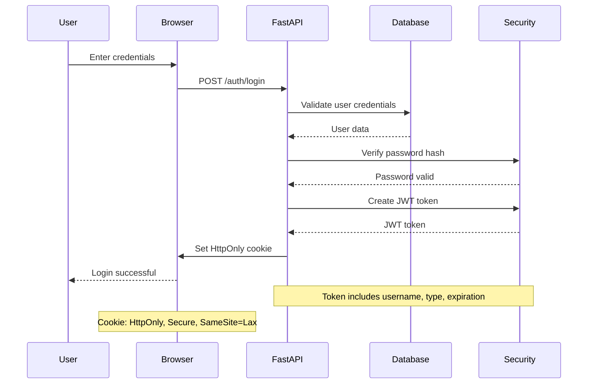
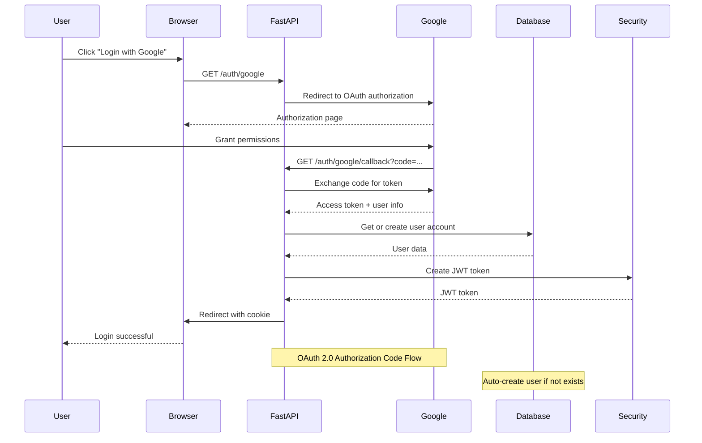
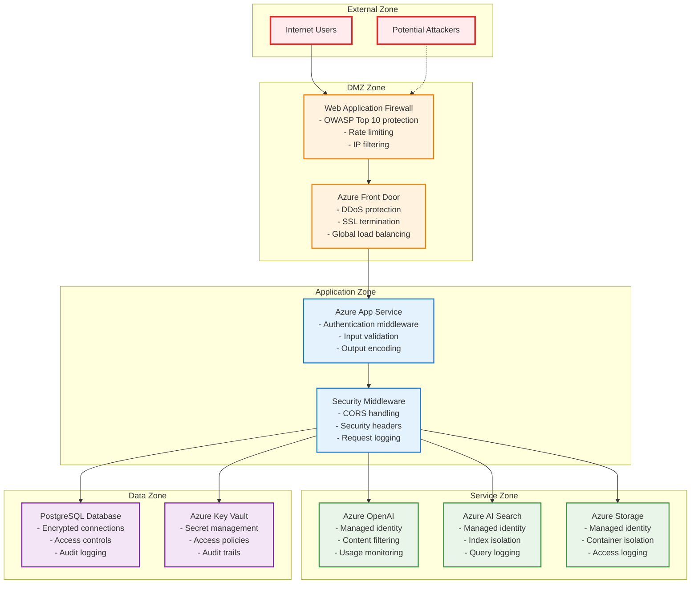

# Security Architecture and Authentication Flows

## Table of Contents
- [Security Overview](#security-overview)
- [Authentication Architecture](#authentication-architecture)
- [Authorization Patterns](#authorization-patterns)
- [Security Boundaries](#security-boundaries)
- [Data Protection](#data-protection)
- [Security Controls](#security-controls)
- [Compliance and Auditing](#compliance-and-auditing)

## Security Overview

The storytelling platform implements a comprehensive security architecture with multiple layers of protection, including authentication, authorization, data encryption, and security monitoring.

### Security Principles

#### Defense in Depth
- **Multiple Security Layers**: Authentication, authorization, input validation, and monitoring
- **Fail-Safe Defaults**: Secure by default configurations and access controls
- **Least Privilege**: Minimal access rights for users and services
- **Zero Trust**: Verify every request regardless of source

#### Security by Design
- **Secure Development**: Security considerations integrated into development process
- **Regular Updates**: Automated security updates and vulnerability management
- **Security Testing**: Automated security scanning and penetration testing
- **Incident Response**: Comprehensive incident response and recovery procedures

## Authentication Architecture

### Authentication Methods

The platform supports multiple authentication methods to accommodate different user preferences and security requirements:

#### Username/Password Authentication
- **Primary Method**: Traditional username and password authentication
- **Password Security**: Argon2 hashing algorithm for password storage
- **Session Management**: JWT tokens with configurable expiration
- **Cookie Security**: HttpOnly, Secure, and SameSite cookie attributes

#### OAuth 2.0 Integration
- **Google OAuth**: Integration with Google OAuth 2.0 for social login
- **Secure Flow**: Authorization code flow with PKCE for enhanced security
- **User Mapping**: Automatic user account creation and linking
- **Fallback Support**: Graceful degradation when OAuth is unavailable

### Authentication Flow Diagrams

#### Standard Login Flow


#### OAuth Authentication Flow


### Authentication Implementation

#### JWT Token Management
```python
# JWT token creation and validation
from jose import jwt, JWTError
from datetime import datetime, timedelta, timezone

class SecurityService:
    def create_access_token(self, data: dict, expires_delta: Optional[timedelta] = None) -> str:
        """Create JWT access token with expiration."""
        to_encode = data.copy()
        if expires_delta:
            expire = datetime.now(timezone.utc) + expires_delta
        else:
            expire = datetime.now(timezone.utc) + timedelta(
                minutes=settings.AUTH_ACCESS_TOKEN_EXPIRE_MINUTES
            )
        
        to_encode.update({"exp": expire})
        encoded_jwt = jwt.encode(to_encode, settings.AUTH_SECRET_KEY, algorithm="HS256")
        return encoded_jwt
    
    async def decode_access_token(self, token: str) -> Optional[Dict[str, Any]]:
        """Decode and validate JWT token."""
        try:
            payload = jwt.decode(
                token, 
                settings.AUTH_SECRET_KEY, 
                algorithms=["HS256"]
            )
            return payload
        except JWTError as e:
            logger.warning(f"Invalid token: {e}")
            return None
```

#### Password Security
```python
# Password hashing with Argon2
from passlib.context import CryptContext

pwd_context = CryptContext(schemes=["argon2"], deprecated="auto")

def verify_password(plain_password: str, hashed_password: str) -> bool:
    """Verify password against hash."""
    return pwd_context.verify(plain_password, hashed_password)

def get_password_hash(password: str) -> str:
    """Hash password using Argon2."""
    return pwd_context.hash(password)
```

#### Cookie Security Configuration
```python
# Secure cookie configuration
response.set_cookie(
    key="access_token",
    value=access_token,
    httponly=True,  # Prevent XSS attacks
    secure=settings.APP_ENV == "production",  # HTTPS only in production
    samesite="lax",  # CSRF protection
    max_age=settings.AUTH_ACCESS_TOKEN_EXPIRE_MINUTES * 60,
    path="/"  # Available across entire application
)
```

## Authorization Patterns

### Role-Based Access Control (RBAC)

The platform implements a flexible RBAC system with multiple authorization patterns:

#### User Roles
- **Regular User**: Standard platform access with content creation capabilities
- **Admin User**: Administrative access with user management and system configuration
- **Moderator**: Content moderation capabilities for community features
- **Premium User**: Enhanced features and higher resource limits

#### Permission Patterns

##### Resource Ownership Validation
```python
async def get_story_for_user(
    story_id: int,
    current_user: User = Depends(get_current_active_user),
    db: AsyncSession = Depends(get_db_session)
) -> Story:
    """Validate story ownership before access."""
    story = await crud_story.get_story(db, story_id)
    
    if not story:
        raise HTTPException(status_code=404, detail="Story not found")
    
    if story.user_id != current_user.id and not current_user.is_admin:
        raise HTTPException(status_code=403, detail="Access denied")
    
    return story
```

##### Admin-Only Access Control
```python
@router.get("/admin/users")
async def list_all_users(
    current_user: User = Depends(get_current_active_user),
    db: AsyncSession = Depends(get_db_session)
):
    """Admin-only endpoint for user management."""
    if not current_user.is_admin:
        raise HTTPException(status_code=403, detail="Admin access required")
    
    users = await crud_user.get_users(db)
    return users
```

##### Context-Aware Authorization
```python
async def check_content_access(
    content_id: int,
    current_user: User,
    db: AsyncSession
) -> bool:
    """Check if user can access content based on context."""
    content = await crud_content.get_content(db, content_id)
    
    # Public content
    if content.is_public:
        return True
    
    # Owner access
    if content.user_id == current_user.id:
        return True
    
    # Shared content
    if await crud_content.is_shared_with_user(db, content_id, current_user.id):
        return True
    
    # Admin access
    if current_user.is_admin:
        return True
    
    return False
```

### API Security Middleware

#### Authentication Middleware
```python
class AuthenticationMiddleware(BaseHTTPMiddleware):
    """Middleware for request authentication."""
    
    async def dispatch(self, request: Request, call_next):
        # Skip authentication for public endpoints
        if self._is_public_endpoint(request.url.path):
            return await call_next(request)
        
        # Extract and validate token
        token = request.cookies.get("access_token")
        if not token:
            return JSONResponse(
                status_code=401,
                content={"detail": "Authentication required"}
            )
        
        # Validate token and set user context
        user = await self._validate_token(token)
        if not user:
            return JSONResponse(
                status_code=401,
                content={"detail": "Invalid authentication"}
            )
        
        # Add user to request state
        request.state.user = user
        return await call_next(request)
```

## Security Boundaries

### Trust Zones and Security Boundaries

The platform implements multiple security boundaries to isolate different components and data:

#### External Boundary
- **Internet-Facing**: Web application accessible from public internet
- **DDoS Protection**: Azure Front Door with rate limiting and traffic filtering
- **SSL/TLS Termination**: HTTPS enforcement with modern cipher suites
- **Web Application Firewall**: Protection against common web attacks

#### Application Boundary
- **Authentication Gateway**: All requests must pass through authentication layer
- **Input Validation**: Comprehensive input sanitization and validation
- **Output Encoding**: XSS prevention through proper output encoding
- **CSRF Protection**: SameSite cookies and CSRF tokens for state-changing operations

#### Data Boundary
- **Database Access**: Encrypted connections with certificate validation
- **Data Encryption**: Encryption at rest and in transit for sensitive data
- **Access Controls**: Database-level permissions and connection pooling
- **Audit Logging**: Comprehensive logging of data access and modifications

#### Service Boundary
- **Azure Services**: Managed identity for service-to-service authentication
- **API Rate Limiting**: Per-user and per-endpoint rate limiting
- **Resource Isolation**: Separate environments for development, staging, and production
- **Network Segmentation**: Virtual network isolation for sensitive services

### Security Boundary Diagram



## Data Protection

### Encryption Strategy

#### Data at Rest
- **Database Encryption**: Transparent Data Encryption (TDE) for PostgreSQL
- **Storage Encryption**: Azure Storage Service Encryption with customer-managed keys
- **Key Management**: Azure Key Vault for encryption key management
- **Backup Encryption**: Encrypted database backups with separate key management

#### Data in Transit
- **HTTPS Enforcement**: TLS 1.2+ for all client communications
- **Service-to-Service**: Encrypted connections between Azure services
- **Certificate Management**: Automated certificate renewal and validation
- **Perfect Forward Secrecy**: Ephemeral key exchange for enhanced security

#### Sensitive Data Handling
```python
# Sensitive data encryption for storage
from cryptography.fernet import Fernet
import base64

class DataProtectionService:
    def __init__(self):
        self.encryption_key = self._get_encryption_key()
        self.cipher_suite = Fernet(self.encryption_key)
    
    def encrypt_sensitive_data(self, data: str) -> str:
        """Encrypt sensitive data before storage."""
        encrypted_data = self.cipher_suite.encrypt(data.encode())
        return base64.urlsafe_b64encode(encrypted_data).decode()
    
    def decrypt_sensitive_data(self, encrypted_data: str) -> str:
        """Decrypt sensitive data after retrieval."""
        decoded_data = base64.urlsafe_b64decode(encrypted_data.encode())
        decrypted_data = self.cipher_suite.decrypt(decoded_data)
        return decrypted_data.decode()
    
    def _get_encryption_key(self) -> bytes:
        """Retrieve encryption key from Key Vault."""
        # Implementation to get key from Azure Key Vault
        pass
```

### Personal Data Protection

#### GDPR Compliance
- **Data Minimization**: Collect only necessary personal data
- **Purpose Limitation**: Use data only for stated purposes
- **Consent Management**: Clear consent mechanisms for data processing
- **Right to Erasure**: User data deletion capabilities
- **Data Portability**: Export user data in standard formats

#### Privacy Controls
```python
# Privacy-aware data handling
class PrivacyService:
    async def anonymize_user_data(self, user_id: int, db: AsyncSession):
        """Anonymize user data while preserving analytics."""
        # Replace PII with anonymized identifiers
        await db.execute(
            update(User)
            .where(User.id == user_id)
            .values(
                email=f"deleted_user_{user_id}@example.com",
                username=f"deleted_user_{user_id}",
                full_name="[Deleted User]"
            )
        )
    
    async def export_user_data(self, user_id: int, db: AsyncSession) -> dict:
        """Export all user data for GDPR compliance."""
        user_data = {
            "profile": await self._get_user_profile(db, user_id),
            "stories": await self._get_user_stories(db, user_id),
            "worlds": await self._get_user_worlds(db, user_id),
            "activity": await self._get_user_activity(db, user_id)
        }
        return user_data
```## 
Security Controls

### Input Validation and Sanitization

#### Comprehensive Input Validation
```python
# Input validation with Pydantic models
from pydantic import BaseModel, Field, validator
import re

class StoryCreateRequest(BaseModel):
    title: str = Field(..., min_length=1, max_length=255)
    description: Optional[str] = Field(None, max_length=2000)
    content: str = Field(..., min_length=1)
    
    @validator('title')
    def validate_title(cls, v):
        # Remove potentially dangerous characters
        if re.search(r'[<>{}[\]]', v):
            raise ValueError('Title contains invalid characters')
        return v.strip()
    
    @validator('content')
    def validate_content(cls, v):
        # Basic XSS prevention
        dangerous_patterns = [
            r'<script[^>]*>.*?</script>',
            r'javascript:',
            r'on\w+\s*=',
        ]
        for pattern in dangerous_patterns:
            if re.search(pattern, v, re.IGNORECASE):
                raise ValueError('Content contains potentially dangerous elements')
        return v
```

#### SQL Injection Prevention
```python
# Parameterized queries with SQLAlchemy
from sqlalchemy import text

class SecureDataAccess:
    async def get_user_stories(self, db: AsyncSession, user_id: int, search_term: str):
        """Secure database query with parameterization."""
        # Using SQLAlchemy ORM (automatically parameterized)
        stories = await db.execute(
            select(Story)
            .where(Story.user_id == user_id)
            .where(Story.title.ilike(f"%{search_term}%"))
        )
        
        # For raw SQL (when necessary), always use parameters
        result = await db.execute(
            text("SELECT * FROM stories WHERE user_id = :user_id AND title ILIKE :search"),
            {"user_id": user_id, "search": f"%{search_term}%"}
        )
        
        return stories.scalars().all()
```

### Rate Limiting and DDoS Protection

#### Application-Level Rate Limiting
```python
# Rate limiting middleware
from slowapi import Limiter, _rate_limit_exceeded_handler
from slowapi.util import get_remote_address
from slowapi.errors import RateLimitExceeded

limiter = Limiter(key_func=get_remote_address)

class RateLimitingService:
    def __init__(self):
        self.limiter = limiter
    
    @limiter.limit("100/minute")
    async def general_endpoint(self, request: Request):
        """General rate limit for most endpoints."""
        pass
    
    @limiter.limit("10/minute")
    async def auth_endpoint(self, request: Request):
        """Stricter rate limit for authentication endpoints."""
        pass
    
    @limiter.limit("5/minute")
    async def ai_generation_endpoint(self, request: Request):
        """Very strict rate limit for resource-intensive AI operations."""
        pass
```

#### Infrastructure-Level Protection
- **Azure Front Door**: DDoS protection and traffic filtering
- **Application Gateway**: Layer 7 load balancing with WAF
- **Network Security Groups**: Network-level access controls
- **Azure DDoS Protection**: Volumetric attack mitigation

### Security Headers and CORS

#### Security Headers Implementation
```python
# Security headers middleware
class SecurityHeadersMiddleware(BaseHTTPMiddleware):
    async def dispatch(self, request: Request, call_next):
        response = await call_next(request)
        
        # Security headers
        response.headers["X-Content-Type-Options"] = "nosniff"
        response.headers["X-Frame-Options"] = "DENY"
        response.headers["X-XSS-Protection"] = "1; mode=block"
        response.headers["Strict-Transport-Security"] = "max-age=31536000; includeSubDomains"
        response.headers["Content-Security-Policy"] = self._get_csp_header()
        response.headers["Referrer-Policy"] = "strict-origin-when-cross-origin"
        response.headers["Permissions-Policy"] = "geolocation=(), microphone=(), camera=()"
        
        return response
    
    def _get_csp_header(self) -> str:
        """Generate Content Security Policy header."""
        return (
            "default-src 'self'; "
            "script-src 'self' 'unsafe-inline' https://www.googletagmanager.com; "
            "style-src 'self' 'unsafe-inline' https://fonts.googleapis.com; "
            "font-src 'self' https://fonts.gstatic.com; "
            "img-src 'self' data: https:; "
            "connect-src 'self' https://api.openai.com https://*.openai.azure.com"
        )
```

#### CORS Configuration
```python
# CORS configuration
from fastapi.middleware.cors import CORSMiddleware

app.add_middleware(
    CORSMiddleware,
    allow_origins=settings.BACKEND_CORS_ORIGINS,
    allow_credentials=True,
    allow_methods=["GET", "POST", "PUT", "DELETE"],
    allow_headers=["*"],
    expose_headers=["X-Total-Count", "X-Rate-Limit-Remaining"]
)
```

### Logging and Monitoring

#### Security Event Logging
```python
# Security event logging
import structlog

security_logger = structlog.get_logger("security")

class SecurityEventLogger:
    async def log_authentication_attempt(self, username: str, success: bool, ip_address: str):
        """Log authentication attempts."""
        security_logger.info(
            "authentication_attempt",
            username=username,
            success=success,
            ip_address=ip_address,
            timestamp=datetime.utcnow().isoformat()
        )
    
    async def log_authorization_failure(self, user_id: int, resource: str, action: str):
        """Log authorization failures."""
        security_logger.warning(
            "authorization_failure",
            user_id=user_id,
            resource=resource,
            action=action,
            timestamp=datetime.utcnow().isoformat()
        )
    
    async def log_suspicious_activity(self, user_id: int, activity: str, details: dict):
        """Log suspicious user activity."""
        security_logger.error(
            "suspicious_activity",
            user_id=user_id,
            activity=activity,
            details=details,
            timestamp=datetime.utcnow().isoformat()
        )
```

#### Security Monitoring Alerts
```python
# Security monitoring and alerting
class SecurityMonitor:
    def __init__(self):
        self.failed_login_threshold = 5
        self.time_window = timedelta(minutes=15)
    
    async def check_brute_force_attempts(self, username: str, db: AsyncSession):
        """Monitor for brute force login attempts."""
        recent_failures = await self._get_recent_login_failures(db, username)
        
        if len(recent_failures) >= self.failed_login_threshold:
            await self._trigger_security_alert(
                "brute_force_detected",
                {"username": username, "attempts": len(recent_failures)}
            )
            await self._temporarily_lock_account(db, username)
    
    async def detect_anomalous_behavior(self, user_id: int, activity: dict):
        """Detect anomalous user behavior patterns."""
        # Implement ML-based anomaly detection
        anomaly_score = await self._calculate_anomaly_score(user_id, activity)
        
        if anomaly_score > 0.8:  # High anomaly threshold
            await self._trigger_security_alert(
                "anomalous_behavior",
                {"user_id": user_id, "score": anomaly_score, "activity": activity}
            )
```

## Compliance and Auditing

### Audit Trail Implementation

#### Comprehensive Audit Logging
```python
# Audit trail for sensitive operations
class AuditService:
    async def log_data_access(self, user_id: int, resource_type: str, resource_id: int, action: str):
        """Log data access for audit purposes."""
        audit_entry = AuditLog(
            user_id=user_id,
            resource_type=resource_type,
            resource_id=resource_id,
            action=action,
            timestamp=datetime.utcnow(),
            ip_address=self._get_client_ip(),
            user_agent=self._get_user_agent()
        )
        
        await self._store_audit_entry(audit_entry)
    
    async def log_configuration_change(self, admin_id: int, setting: str, old_value: str, new_value: str):
        """Log system configuration changes."""
        audit_entry = ConfigurationAuditLog(
            admin_id=admin_id,
            setting=setting,
            old_value=old_value,
            new_value=new_value,
            timestamp=datetime.utcnow()
        )
        
        await self._store_configuration_audit(audit_entry)
```

### Security Compliance Framework

#### OWASP Top 10 Mitigation
1. **Injection**: Parameterized queries and input validation
2. **Broken Authentication**: Strong authentication and session management
3. **Sensitive Data Exposure**: Encryption at rest and in transit
4. **XML External Entities**: Input validation and secure parsing
5. **Broken Access Control**: Comprehensive authorization checks
6. **Security Misconfiguration**: Secure defaults and configuration management
7. **Cross-Site Scripting**: Input validation and output encoding
8. **Insecure Deserialization**: Safe deserialization practices
9. **Known Vulnerabilities**: Regular dependency updates and scanning
10. **Insufficient Logging**: Comprehensive security event logging

#### Security Assessment Schedule
- **Daily**: Automated vulnerability scanning
- **Weekly**: Security log review and analysis
- **Monthly**: Penetration testing and security assessment
- **Quarterly**: Security architecture review and updates
- **Annually**: Comprehensive security audit and compliance review

### Incident Response Plan

#### Security Incident Classification
- **Low**: Minor security events with minimal impact
- **Medium**: Security events requiring investigation and response
- **High**: Security breaches with potential data exposure
- **Critical**: Active attacks or confirmed data breaches

#### Incident Response Workflow
```python
# Incident response automation
class IncidentResponseService:
    async def handle_security_incident(self, incident_type: str, severity: str, details: dict):
        """Automated incident response workflow."""
        incident_id = await self._create_incident_record(incident_type, severity, details)
        
        if severity in ["high", "critical"]:
            await self._notify_security_team(incident_id, details)
            await self._initiate_containment_measures(incident_type)
        
        if severity == "critical":
            await self._activate_emergency_response(incident_id)
            await self._notify_executive_team(incident_id)
        
        await self._start_investigation(incident_id)
        return incident_id
    
    async def _initiate_containment_measures(self, incident_type: str):
        """Implement containment measures based on incident type."""
        if incident_type == "brute_force_attack":
            await self._enable_enhanced_rate_limiting()
            await self._block_suspicious_ips()
        elif incident_type == "data_breach":
            await self._isolate_affected_systems()
            await self._preserve_evidence()
```

### Security Metrics and KPIs

#### Security Monitoring Dashboard
- **Authentication Success Rate**: Percentage of successful login attempts
- **Failed Login Attempts**: Number of failed authentication attempts
- **Security Incidents**: Count and severity of security incidents
- **Vulnerability Remediation Time**: Time to fix identified vulnerabilities
- **Compliance Score**: Overall security compliance rating

#### Security Reporting
```python
# Security metrics collection
class SecurityMetricsService:
    async def generate_security_report(self, start_date: datetime, end_date: datetime) -> dict:
        """Generate comprehensive security report."""
        return {
            "authentication_metrics": await self._get_auth_metrics(start_date, end_date),
            "incident_summary": await self._get_incident_summary(start_date, end_date),
            "vulnerability_status": await self._get_vulnerability_status(),
            "compliance_status": await self._get_compliance_status(),
            "security_trends": await self._analyze_security_trends(start_date, end_date)
        }
```

---
**Document Information:**
- Last Updated: 2025-07-14
- Version: 1.0.0
- Author: Security Team
- Reviewers: Architecture Team, Compliance Team