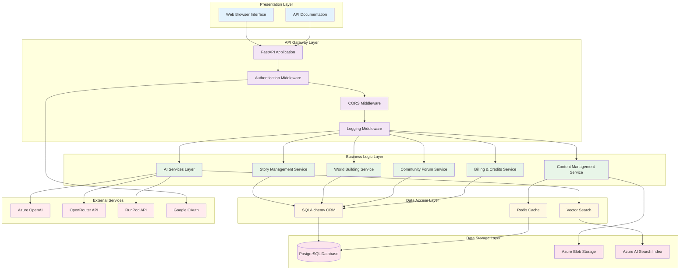

# System Overview

## Table of Contents
- [Platform Purpose](#platform-purpose)
- [High-Level Architecture](#high-level-architecture)
- [System Characteristics](#system-characteristics)
- [Technology Stack](#technology-stack)
- [Architectural Principles](#architectural-principles)
- [System Boundaries](#system-boundaries)

## Platform Purpose

The AI-powered storytelling platform is a comprehensive web application designed to enable creative writers, world builders, and storytelling enthusiasts to create, collaborate, and share interactive stories with the assistance of artificial intelligence.

### Core Capabilities
- **Story Creation**: Multi-act story structure with scenes and narrative elements
- **World Building**: Comprehensive world creation with characters, locations, and lore
- **AI Assistance**: Intelligent writing assistance, content generation, and creative suggestions
- **Community Features**: Forums, story sharing, and collaborative world building
- **Content Management**: Document upload, image generation, and media management

### Target Users
- **Creative Writers**: Authors seeking AI assistance for story development
- **World Builders**: Users creating detailed fictional universes
- **Community Members**: Readers and collaborators engaging with shared content
- **Administrators**: System managers overseeing platform operations

## High-Level Architecture

The platform follows a layered, microservices-oriented architecture with clear separation of concerns:

### Layer Responsibilities

#### Presentation Layer
- **Web Interface**: React-based frontend for user interactions
- **API Documentation**: OpenAPI/Swagger documentation for developers

#### API Gateway Layer
- **FastAPI Application**: Main application server and request routing
- **Authentication**: JWT-based auth with OAuth integration
- **Middleware Stack**: CORS, logging, security, and request processing

#### Business Logic Layer
- **Story Management**: Story creation, editing, and organization
- **World Building**: Character, location, and lore management
- **AI Services**: Content generation, embeddings, and search
- **Community Features**: Forums, discussions, and social features
- **Billing System**: Credit management and usage tracking
- **Content Management**: File uploads, image generation, and media

#### Data Access Layer
- **ORM**: SQLAlchemy for database operations
- **Caching**: Redis for performance optimization
- **Vector Search**: AI-powered content search and retrieval

#### Data Storage Layer
- **PostgreSQL**: Primary relational database
- **Blob Storage**: File and media storage
- **Search Index**: Vector embeddings and full-text search

## System Characteristics

### Scalability
- **Horizontal Scaling**: Stateless application design supports multiple instances
- **Database Scaling**: Connection pooling and query optimization
- **Caching Strategy**: Multi-level caching for performance
- **Async Processing**: Background jobs for heavy operations

### Reliability
- **Error Handling**: Comprehensive exception handling and logging
- **Circuit Breakers**: Protection against external service failures
- **Data Consistency**: ACID transactions for critical operations
- **Backup Strategy**: Automated database and file backups

### Security
- **Authentication**: Multi-factor authentication with OAuth
- **Authorization**: Role-based access control (RBAC)
- **Data Protection**: Encryption at rest and in transit
- **Input Validation**: Comprehensive input sanitization

### Performance
- **Response Times**: Sub-second response for most operations
- **Throughput**: Designed for concurrent user sessions
- **Resource Optimization**: Efficient memory and CPU usage
- **CDN Integration**: Static asset delivery optimization

## Technology Stack
wsl

### Development Tools
- **Pytest**: Testing framework
- **Black**: Code formatting
- **Flake8**: Code linting
- **GitHub Actions**: CI/CD pipeline

## Architectural Principles

### Separation of Concerns
Each layer has distinct responsibilities with minimal overlap, enabling independent development and testing.

### Dependency Inversion
High-level modules don't depend on low-level modules; both depend on abstractions.

### Single Responsibility
Each service and component has a single, well-defined purpose.

### Open/Closed Principle
Components are open for extension but closed for modification.

### API-First Design
All functionality is exposed through well-defined APIs with comprehensive documentation.

### Event-Driven Architecture
Asynchronous processing for non-critical operations to improve responsiveness.

### Fail-Fast Philosophy
Early detection and handling of errors to prevent cascading failures.

## System Boundaries

### Internal Systems
- **Core Application**: Story and world management
- **AI Services**: Content generation and analysis
- **User Management**: Authentication and authorization
- **Content Management**: File and media handling

### External Dependencies
- **Azure Services**: OpenAI, Search, Storage, Key Vault
- **Third-Party APIs**: OpenRouter, RunPod, Google OAuth
- **Infrastructure**: Database, caching, monitoring

### Integration Points
- **REST APIs**: Primary integration method for external services
- **Webhooks**: Event-driven integrations where supported
- **File Uploads**: Direct integration with storage services
- **Authentication**: OAuth and JWT token validation

---
**Document Information:**
- Last Updated: 2025-07-14
- Version: 1.0.0
- Author: Architecture Team
- Reviewers: Technical Leads