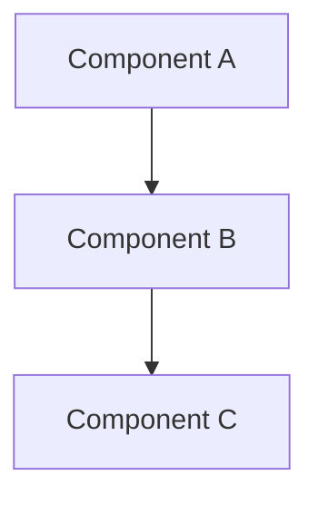

# [Document Title]

## Table of Contents
- [Overview](#overview)
- [Architecture](#architecture)
- [Components](#components)
- [Implementation Details](#implementation-details)
- [Configuration](#configuration)
- [Troubleshooting](#troubleshooting)
- [References](#references)

## Overview

### Purpose
Brief description of what this document covers and its intended audience.

### Scope
Define what is and isn't covered in this document.

### Prerequisites
List any required knowledge or setup needed to understand this document.

## Architecture

### High-Level Design
Include architectural diagrams and high-level explanations.



### Key Principles
List the architectural principles and design decisions.

## Components

### Component Name
#### Purpose
What this component does and why it exists.

#### Responsibilities
- Responsibility 1
- Responsibility 2
- Responsibility 3

#### Interfaces
- Input interfaces
- Output interfaces
- Dependencies

#### Configuration
```yaml
# Example configuration
component:
  setting1: value1
  setting2: value2
```

## Implementation Details

### Code Structure
```
src/
├── component/
│   ├── __init__.py
│   ├── service.py
│   └── models.py
```

### Key Classes and Functions
```python
class ExampleService:
    """Example service implementation."""
    
    def process_data(self, data: Dict) -> Dict:
        """Process input data and return results."""
        pass
```

### Data Flow
Describe how data moves through the system.

## Configuration

### Environment Variables
| Variable | Description | Default | Required |
|----------|-------------|---------|----------|
| VAR_NAME | Variable description | default_value | Yes/No |

### Configuration Files
List and describe configuration files and their purposes.

## Troubleshooting

### Common Issues
#### Issue: Problem Description
**Symptoms:** What users see when this problem occurs.

**Cause:** Why this problem happens.

**Solution:** Step-by-step resolution.

### Debugging
- How to enable debug logging
- Key log messages to look for
- Diagnostic commands

## References

### Internal Documentation
- Link to related architecture documents
- Link to API documentation
- Link to deployment guides

### External Resources
- Official documentation links
- Relevant blog posts or articles
- Community resources

---
**Document Information:**
- Last Updated: [Date]
- Version: [Version Number]
- Author: [Author Name]
- Reviewers: [Reviewer Names]