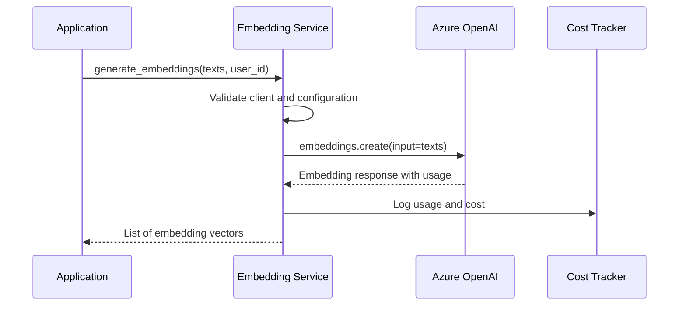
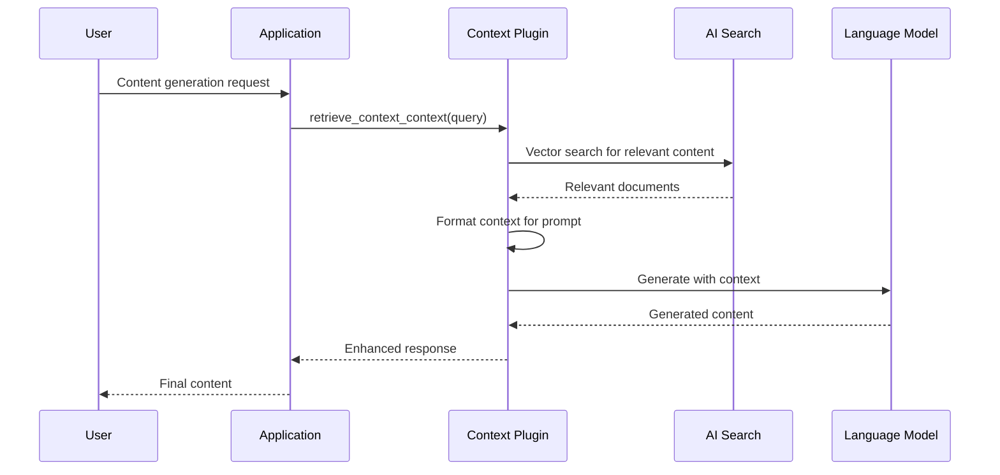
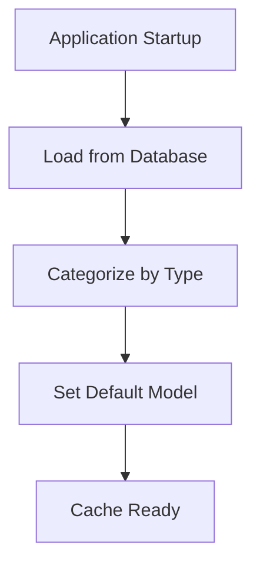
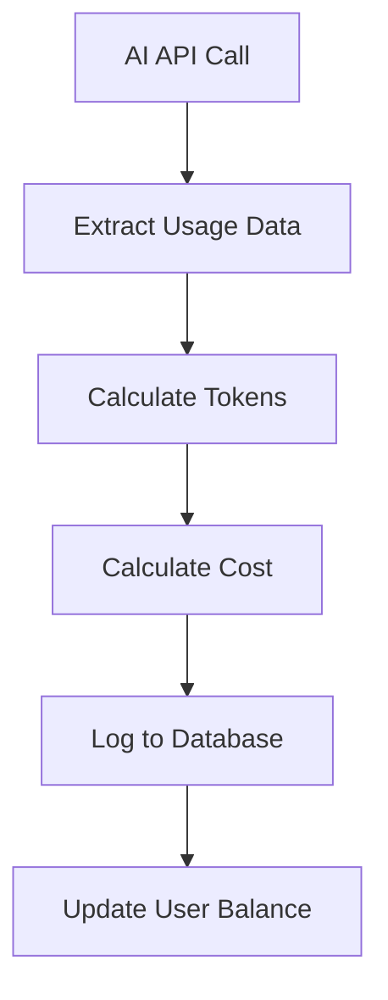

# AI Services Architecture and Integrations

## Table of Contents
- [AI Services Overview](#ai-services-overview)
- [Azure OpenAI Integration](#azure-openai-integration)
- [Semantic Kernel Architecture](#semantic-kernel-architecture)
- [AI Search and Context Implementation](#ai-search-and-rag-implementation)
- [AI Model Management](#ai-model-management)
- [Cost Tracking and Usage Monitoring](#cost-tracking-and-usage-monitoring)
- [Multi-Provider AI Integration](#multi-provider-ai-integration)

## AI Services Overview

The AI services layer provides comprehensive artificial intelligence capabilities for content generation, analysis, and enhancement throughout the storytelling platform. The architecture supports multiple AI providers, cost tracking, and sophisticated prompt management.

### AI Services Architecture

```mermaid
graph TB
    subgraph "AI Services Layer"
        SK[Semantic Kernel]
        EMBEDDING[Embedding Service]
        SEARCH[AI Search Service]
        MODEL_CACHE[AI Model Cache]
        CLIENT_FACTORY[AI Client Factory]
        COST_TRACKER[Cost Tracker Service]
    end
    
    subgraph "AI Providers"
        AZURE_OPENAI[Azure OpenAI]
        OPENROUTER[OpenRouter]
        RUNPOD[RunPod]
        OPENAI[OpenAI Direct]
    end
    
    subgraph "SK Plugins"
        STORY_ANALYSIS[Story Analysis Plugin]
        STORYTELLING[Storytelling Plugin]
        STORY_STRUCTURE[Story Structure Plugin]
        WORLD_BUILDING[World Building Plugin]
        WORLD_GENERATION[World Generation Plugin]
        RETRIEVAL[Context Retrieval Plugin]
    end
    
    subgraph "Data Storage"
        AI_SEARCH_INDEX[Azure AI Search Index]
        POSTGRES[(PostgreSQL)]
        BLOB_STOContextE[Azure Blob Storage]
    end
    
    %% Service connections
    SK --> MODEL_CACHE
    SK --> CLIENT_FACTORY
    SK --> STORY_ANALYSIS
    SK --> STORYTELLING
    SK --> STORY_STRUCTURE
    SK --> WORLD_BUILDING
    SK --> WORLD_GENERATION
    SK --> RETRIEVAL
    
    EMBEDDING --> AZURE_OPENAI
    SEARCH --> AI_SEARCH_INDEX
    CLIENT_FACTORY --> AZURE_OPENAI
    CLIENT_FACTORY --> OPENROUTER
    CLIENT_FACTORY --> RUNPOD
    CLIENT_FACTORY --> OPENAI
    
    RETRIEVAL --> SEARCH
    COST_TRACKER --> POSTGRES
    
    %% Styling
    classDef aiServices fill:#e8f5e8,stroke:#388e3c,stroke-width:2px
    classDef providers fill:#ffebee,stroke:#d32f2f,stroke-width:2px
    classDef plugins fill:#e3f2fd,stroke:#1976d2,stroke-width:2px
    classDef storage fill:#fff3e0,stroke:#f57c00,stroke-width:2px
    
    class SK,EMBEDDING,SEARCH,MODEL_CACHE,CLIENT_FACTORY,COST_TRACKER aiServices
    class AZURE_OPENAI,OPENROUTER,RUNPOD,OPENAI providers
    class STORY_ANALYSIS,STORYTELLING,STORY_STRUCTURE,WORLD_BUILDING,WORLD_GENERATION,RETRIEVAL plugins
    class AI_SEARCH_INDEX,POSTGRES,BLOB_STOContextE storage
```



### Core AI Capabilities
- **Text Generation**: Story content, character development, world building
- **Content Analysis**: Story structure analysis, content review
- **Embeddings**: Vector representations for semantic search
- **Image Generation**: AI-powered visual content creation
- **Context (direct context assembly)**: Context-aware content generation
- **Cost Management**: Usage tracking and billing integration

## Azure OpenAI Integration

### Service Configuration

The Azure OpenAI integration provides the primary AI capabilities through multiple deployment models:

#### Embedding Service (`app/services/embedding_service.py`)

```python
# Singleton pattern for embedding client
_shared_embedding_client: Optional[AsyncAzureOpenAI] = None

def initialize_embedding_client():
    global _shared_embedding_client
    if _shared_embedding_client is None:
        _shared_embedding_client = AsyncAzureOpenAI(
            api_key=settings.AZURE_OPENAI_API_KEY,
            azure_endpoint=str(settings.AZURE_OPENAI_ENDPOINT),
            api_version=settings.AZURE_OPENAI_API_VERSION,
        )
```

#### Key Features
- **Async Client Management**: Shared client instance with proper lifecycle management
- **Error Handling**: Comprehensive error handling and logging
- **Cost Tracking**: Integration with cost tracking service
- **Performance Monitoring**: Request duration and token usage tracking

#### Embedding Generation Flow



### Azure AI Search Service (`app/services/azure_ai_search_service.py`)

#### Architecture Features
- **Async Client Support**: Full async/await pattern implementation
- **Vector Search**: Semantic search capabilities with embeddings
- **Document Management**: Upload, search, and delete operations
- **Error Resilience**: Comprehensive error handling and recovery

#### Search Operations

```python
async def perform_search_async(self, query_text: str, top_k: int = 5, **kwargs) -> List[Dict[str, Any]]:
    results = await self.search_client.search(
        search_text=query_text, 
        top=top_k, 
        include_total_count=True, 
        **kwargs
    )
    documents = []
    async for doc in results:
        documents.append(dict(doc))
    return documents
```

## Semantic Kernel Architecture

### Kernel Initialization (`app/services/sk_kernel_instance.py`)

The Semantic Kernel serves as the orchestration layer for AI operations, providing plugin-based functionality and multi-service integration.

#### Service Registration Pattern

```python
def _initialize_sk_services_and_plugins():
    # Azure OpenAI Chat Service
    kernel.add_service(AzureChatCompletion(
        service_id=chat_service_id,
        deployment_name=chat_deployment_name,
        endpoint=azure_openai_endpoint,
        api_key=azure_openai_api_key,
        api_version=azure_openai_api_version
    ))
    
    # Azure Text Embedding Service
    kernel.add_service(AzureTextEmbedding(
        service_id=embedding_service_id,
        deployment_name=embedding_deployment_name,
        endpoint=azure_openai_endpoint,
        api_key=azure_openai_api_key,
        api_version=azure_openai_api_version
    ))
```

### Plugin Architecture

#### Available Plugins
1. **Story Analysis Plugin**: Content review and metadata generation
2. **Storytelling Plugin**: Narrative generation and scene creation
3. **Story Structure Plugin**: Story organization and scene extraction
4. **World Building Plugin**: Character, location, and lore management
5. **World Generation Plugin**: Automated world creation from prompts
6. **Context Retrieval Plugin**: Context-aware content retrieval

#### Plugin Function Export Pattern

```python
# Exported function references for application use
review_act_content_function = None
generate_act_narrative_only_function = None
generate_scene_narrative_only_function = None
retrieve_context_context_function = None

def _update_exported_functions():
    """Update exported function references after kernel initialization."""
    global review_act_content_function
    review_act_content_function = kernel.plugins.get(STORY_ANALYSIS_PLUGIN_NAME, {}).get("ReviewActContentEnhanced")
```

### Prompt Management

#### File-Based Prompt System
```python
def load_prompt_from_file_global(filename: str) -> str:
    filepath = os.path.join(PROMPTS_SYSTEM_DIR, filename)
    with open(filepath, 'r', encoding='utf-8') as f:
        content = f.read()
    return content
```

#### Prompt Organization
```
app/prompts/system/
├── story_analysis/
│   ├── review_act_content.txt
│   └── generate_metadata.txt
├── storytelling/
│   ├── generate_narrative.txt
│   └── scene_creation.txt
└── world_building/
    ├── character_generation.txt
    └── location_creation.txt
```

## AI Search and Context Implementation

### Context Architecture Flow



### Vector Search Implementation

#### Document Indexing Process
1. **Content Chunking**: Break documents into semantic chunks
2. **Embedding Generation**: Create vector representations
3. **Index Upload**: Store in Azure AI Search with metadata
4. **Relationship Mapping**: Link to source entities (stories, worlds, characters)

#### Search Configuration
```python
# Context retrieval settings
Context_RETRIEVAL_TOP_K = 3  # Number of documents to retrieve
Context_WRITING_ASSISTANT_TOP_K = 10  # For writing assistance
Context_CHAT_TOP_K = 7  # For chat interactions
Context_MIN_RELEVANCE_SCORE = 0.7  # Minimum relevance threshold
```

## AI Model Management

### AI Model Cache (`app/services/ai_model_cache.py`)

#### Cache Architecture
```python
class AIModelCache:
    def __init__(self):
        self.configurations = {}  # All models by ID
        self.generation_models = {}  # Generation models only
        self.embedding_models = {}  # Embedding models only
        self.default_generation_model = None  # Default model reference
```

#### Model Loading Process


### AI Client Factory (`app/services/ai_client_factory.py`)

#### Multi-Provider Support
```python
@staticmethod
def create_client(provider: AIProviderEnum) -> Union[openai.AsyncAzureOpenAI, openai.AsyncOpenAI]:
    if provider == AIProviderEnum.AZURE:
        return AIClientFactory._create_azure_client()
    elif provider == AIProviderEnum.OPENROUTER:
        return AIClientFactory._create_openrouter_client()
    elif provider == AIProviderEnum.OPENAI:
        return AIClientFactory._create_openai_client()
```

#### Provider Configuration
- **Azure OpenAI**: Enterprise-grade with deployment-specific models
- **OpenRouter**: Access to multiple model providers through unified API
- **OpenAI Direct**: Direct OpenAI API access for specific models
- **RunPod**: Custom model hosting for specialized use cases

## Cost Tracking and Usage Monitoring

### Cost Tracking Service (`app/services/cost_tracker_service.py`)

#### Cost Calculation Architecture



#### Token Estimation
```python
def estimate_tokens_for_streaming_call(input_text: str, output_text: str, model_name: str) -> Dict[str, int]:
    """Estimate tokens for streaming calls where usage isn't provided."""
    encoding_name = get_openrouter_token_encoding(model_name)
    encoding = tiktoken.get_encoding(encoding_name)
    
    return {
        "prompt_tokens": len(encoding.encode(input_text)),
        "completion_tokens": len(encoding.encode(output_text))
    }
```

#### Cost Calculation by Provider
- **Azure OpenAI**: Token-based pricing with deployment-specific rates
- **OpenRouter**: Provider-specific pricing with unified billing
- **OpenAI Direct**: Standard OpenAI pricing model
- **Custom Models**: Configurable pricing per model

### Usage Monitoring Features
- **Real-time Cost Tracking**: Immediate cost calculation and logging
- **User Balance Management**: Credit system integration
- **Usage Analytics**: Detailed usage patterns and trends
- **Cost Optimization**: Model selection based on cost-effectiveness
- **Billing Integration**: Automatic billing and payment processing

## Multi-Provider AI Integration

### Provider Abstraction Layer

The platform supports multiple AI providers through a unified interface:

#### Provider Capabilities Matrix
| Provider | Text Generation | Embeddings | Image Generation | Custom Models |
|----------|----------------|------------|------------------|---------------|
| Azure OpenAI | ✅ | ✅ | ❌ | ✅ |
| OpenRouter | ✅ | ❌ | ❌ | ✅ |
| OpenAI Direct | ✅ | ✅ | ✅ | ❌ |
| RunPod | ✅ | ❌ | ✅ | ✅ |

#### Dynamic Model Selection
```python
# Model selection based on requirements
def select_optimal_model(task_type: str, cost_preference: str, quality_requirement: str):
    models = model_cache.get_models_by_type(task_type)
    
    if cost_preference == "low_cost":
        return min(models, key=lambda m: m.user_price_output_usd_pm)
    elif quality_requirement == "high":
        return max(models, key=lambda m: m.quality_score)
    else:
        return model_cache.default_generation_model
```

### Error Handling and Fallbacks

#### Circuit Breaker Pattern
```python
async def ai_call_with_fallback(primary_model, fallback_model, prompt):
    try:
        return await call_ai_model(primary_model, prompt)
    except Exception as e:
        logger.warning(f"Primary model failed: {e}, trying fallback")
        return await call_ai_model(fallback_model, prompt)
```

#### Provider Health Monitoring
- **Response Time Tracking**: Monitor API response times
- **Error Rate Monitoring**: Track failure rates by provider
- **Automatic Failover**: Switch to backup providers on failures
- **Health Dashboards**: Real-time provider status monitoring

---
**Document Information:**
- Last Updated: 2025-07-14
- Version: 1.0.0
- Author: Architecture Team
- Reviewers: AI Services Team
