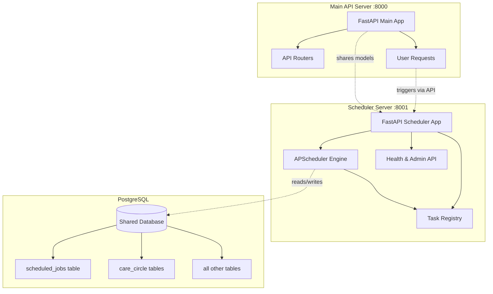

# FastAPI Scheduler Server Architecture

## Overview

A standalone FastAPI application that runs scheduled background tasks independently of the main API server. It runs on its own port (default `8001`), shares the same PostgreSQL database, and reuses existing service modules from the `app/` package.

**Key Design Decisions:**
- **No message broker required** — uses APScheduler with PostgreSQL-backed job persistence
- **Shares the same codebase** — imports from `app/services/`, `app/crud/`, `app/models/`
- **Independent lifecycle** — starts/stops independently, with its own health endpoint
- **Same dependency injection patterns** — uses the same `get_db_session`, settings, etc.

---

## System Architecture



---

## Directory Structure

```
app/
├── scheduler/                    # NEW: Scheduler server package
│   ├── __init__.py
│   ├── main.py                   # FastAPI app entry point
│   ├── config.py                 # Scheduler-specific settings
│   ├── scheduler_engine.py       # APScheduler setup + lifecycle
│   ├── registry.py               # Task registry (decorator-based)
│   ├── tasks/                    # Scheduled task implementations
│   │   ├── __init__.py
│   │   ├── base.py               # BaseTask class
│   │   ├── care_circle_newsletter.py   # Daily newsletter dispatch
│   │   ├── care_circle_session.py      # Daily session pre-generation
│   │   └── cleanup.py                  # Log/DB cleanup tasks
│   ├── routers/                  # Admin/health API routes
│   │   ├── __init__.py
│   │   ├── health.py             # GET /health, GET /status
│   │   └── jobs.py               # GET /jobs, POST /jobs/{id}/run, etc.
│   └── schemas.py                # Pydantic models for API

tests/
├── unit/
│   └── scheduler/                # NEW: Scheduler unit tests
│       ├── __init__.py
│       ├── conftest.py           # Scheduler-specific fixtures
│       ├── test_registry.py      # Task registry tests
│       ├── test_scheduler_engine.py  # APScheduler lifecycle tests
│       ├── test_tasks/
│       │   ├── __init__.py
│       │   ├── test_care_circle_newsletter.py
│       │   ├── test_care_circle_session.py
│       │   └── test_cleanup.py
│       └── test_routers/
│           ├── __init__.py
│           ├── test_health.py    # Health endpoint tests
│           └── test_jobs.py      # Job management endpoint tests
├── integration/
│   └── scheduler/                # NEW: Scheduler integration tests
│       ├── __init__.py
│       ├── conftest.py           # Integration test client fixture
│       ├── test_scheduler_health.py
│       └── test_scheduler_jobs.py

plans/
├── fastapi-scheduler-server-architecture.md  # This file

docker-compose.yml                # Updated with scheduler service
docker-compose.dev.yml            # Updated for dev
Dockerfile.scheduler              # Optional: dedicated Dockerfile
```

---

## Component Design

### 1. Scheduler Engine (`app/scheduler/scheduler_engine.py`)

Uses **APScheduler** with a **PostgreSQL job store** for persistence. This means scheduled jobs survive server restarts.

```python
"""APScheduler engine with PostgreSQL-backed job persistence."""

from apscheduler.schedulers.asyncio import AsyncIOScheduler
from apscheduler.jobstores.postgresql import PostgreSQLJobStore
from apscheduler.executors.asyncio import AsyncIOExecutor
from sqlalchemy.ext.asyncio import AsyncSession

from app.core.config import settings


def build_job_store_url() -> str:
    """Build a synchronous psycopg2 URL for APScheduler's job store."""
    # APScheduler's PostgreSQLJobStore uses psycopg2 (sync), not asyncpg
    return (
        f"postgresql://{settings.POSTGRES_USER}:{settings.POSTGRES_PASSWORD}"
        f"@{settings.POSTGRES_SERVER}:{settings.POSTGRES_PORT}/{settings.POSTGRES_DB}"
    )


def create_scheduler() -> AsyncIOScheduler:
    """Create and configure the APScheduler instance."""
    job_store = PostgreSQLJobStore(url=build_job_store_url(), tablename="scheduled_jobs")
    
    executors = {
        "default": AsyncIOExecutor(),
    }
    
    job_defaults = {
        "coalesce": True,       # Combine missed runs into one
        "max_instances": 1,     # Only one instance of each job at a time
        "misfire_grace_time": 300,  # 5 minutes grace for missed jobs
    }
    
    scheduler = AsyncIOScheduler(
        jobstores={"default": job_store},
        executors=executors,
        job_defaults=job_defaults,
        timezone=settings.TIMEZONE,
    )
    
    return scheduler
```

### 2. Task Registry (`app/scheduler/registry.py`)

A decorator-based registry that makes it easy to define and schedule tasks.

```python
"""Task registry for the scheduler server."""

from __future__ import annotations
import logging
from typing import Callable, Optional
from dataclasses import dataclass, field

logger = logging.getLogger(__name__)


@dataclass
class TaskDefinition:
    """Metadata for a schedulable task."""
    key: str                          # Unique identifier, e.g. "care_circle.daily_newsletter"
    name: str                         # Human-readable name
    func: Callable                    # The async function to call
    default_cron: str                 # Default cron expression, e.g. "0 8 * * *"
    description: str = ""
    enabled_by_default: bool = True
    max_instances: int = 1
    misfire_grace_time: int = 300     # seconds


# Global registry
_TASKS: dict[str, TaskDefinition] = {}


def register_task(
    key: str,
    name: str,
    default_cron: str,
    description: str = "",
    enabled_by_default: bool = True,
    max_instances: int = 1,
    misfire_grace_time: int = 300,
) -> Callable:
    """Decorator to register a function as a schedulable task."""
    def decorator(func: Callable) -> Callable:
        _TASKS[key] = TaskDefinition(
            key=key,
            name=name,
            func=func,
            default_cron=default_cron,
            description=description,
            enabled_by_default=enabled_by_default,
            max_instances=max_instances,
            misfire_grace_time=misfire_grace_time,
        )
        logger.info(f"Registered task: {key} ({name})")
        return func
    return decorator


def get_task(key: str) -> Optional[TaskDefinition]:
    """Look up a task by key."""
    return _TASKS.get(key)


def list_tasks() -> list[TaskDefinition]:
    """Return all registered tasks."""
    return list(_TASKS.values())
```

### 3. Example Task: Care Circle Newsletter (`app/scheduler/tasks/care_circle_newsletter.py`)

```python
"""Daily Care Circle newsletter dispatch task."""

import logging
from datetime import datetime
from sqlalchemy import select
from sqlalchemy.ext.asyncio import AsyncSession

from app.scheduler.registry import register_task
from app.db.database import async_session_local
from app.models.care_circle import CareCirclePatientProfile
from app.services.care_circle.session_assembler import assemble_daily_patient_session
from app.services.care_circle.newsletter_email_service import send_newsletter_email
from app.services.care_circle.newsletter_sms_service import send_sms_newsletter

logger = logging.getLogger(__name__)


@register_task(
    key="care_circle.daily_newsletter",
    name="Daily Care Circle Newsletter",
    default_cron="0 8 * * *",  # 8:00 AM daily
    description="Assembles and sends daily newsletter to all active patients via email and SMS.",
    enabled_by_default=True,
    max_instances=3,  # Allow parallel sends for multiple patients
    misfire_grace_time=600,
)
async def dispatch_daily_newsletter() -> dict:
    """Send daily newsletter to all active patients."""
    results = []
    
    async with async_session_local() as db:
        patients = (await db.execute(
            select(CareCirclePatientProfile).where(
                CareCirclePatientProfile.access_state == "active"
            )
        )).scalars().all()
    
    logger.info(f"Dispatching daily newsletter to {len(patients)} patients")
    
    for patient in patients:
        try:
            # Assemble the patient's daily session
            session_data = await assemble_daily_patient_session(patient.id)
            
            # Send email newsletter
            if patient.email:
                email_result = await send_newsletter_email(
                    patient, session_data.get("html", "")
                )
                logger.info(f"Email to {patient.email}: {email_result}")
            
            # Send SMS newsletter
            if patient.phone_number:
                sms_result = await send_sms_newsletter(
                    patient, session_data.get("provider_results", [])
                )
                logger.info(f"SMS to {patient.phone_number}: {sms_result}")
            
            results.append({
                "patient_id": patient.id,
                "patient_name": patient.display_name,
                "status": "sent",
            })
            
        except Exception as exc:
            logger.error(f"Failed to send newsletter to patient {patient.id}: {exc}")
            results.append({
                "patient_id": patient.id,
                "patient_name": patient.display_name,
                "status": "failed",
                "error": str(exc),
            })
    
    return {
        "task": "care_circle.daily_newsletter",
        "executed_at": datetime.utcnow().isoformat(),
        "total_patients": len(patients),
        "results": results,
    }
```

### 4. Scheduler Main App (`app/scheduler/main.py`)

```python
"""FastAPI Scheduler Server entry point."""

import logging
from contextlib import asynccontextmanager

from fastapi import FastAPI
from fastapi.middleware.cors import CORSMiddleware

from app.core.config import settings, log_application_settings
from app.scheduler.scheduler_engine import create_scheduler
from app.scheduler.registry import list_tasks
from app.scheduler.routers.health import router as health_router
from app.scheduler.routers.jobs import router as jobs_router

logger = logging.getLogger(__name__)

# Global scheduler instance
scheduler = None


@asynccontextmanager
async def lifespan(app_instance: FastAPI):
    """Manage scheduler lifecycle."""
    global scheduler
    
    logger.info("Scheduler Server: Starting up...")
    log_application_settings()
    
    # Create and start scheduler
    scheduler = create_scheduler()
    
    # Register all tasks from the tasks package
    from app.scheduler.tasks import care_circle_newsletter, care_circle_session, cleanup  # noqa: F401
    
    # Schedule enabled tasks
    from app.scheduler.registry import list_tasks
    for task_def in list_tasks():
        if task_def.enabled_by_default:
            scheduler.add_job(
                func=task_def.func,
                trigger="cron",
                id=task_def.key,
                name=task_def.name,
                cron=task_def.default_cron,
                max_instances=task_def.max_instances,
                misfire_grace_time=task_def.misfire_grace_time,
                replace_existing=True,
            )
            logger.info(f"Scheduled task: {task_def.key} ({task_def.default_cron})")
    
    scheduler.start()
    logger.info("Scheduler Server: Started")
    
    try:
        yield
    finally:
        logger.info("Scheduler Server: Shutting down...")
        if scheduler:
            scheduler.shutdown(wait=False)
        logger.info("Scheduler Server: Shutdown complete")


app = FastAPI(
    title="Ink & Quill Scheduler",
    description="Background task scheduler for Care Circle and platform services",
    version="1.0.0",
    lifespan=lifespan,
)

# CORS for frontend access to health/status
app.add_middleware(
    CORSMiddleware,
    allow_origins=[str(o).strip() for o in settings.BACKEND_CORS_ORIGINS],
    allow_credentials=True,
    allow_methods=["*"],
    allow_headers=["*"],
)

# Include routers
app.include_router(health_router, prefix="/scheduler", tags=["Health"])
app.include_router(jobs_router, prefix="/scheduler", tags=["Jobs"])


if __name__ == "__main__":
    import uvicorn
    host = "0.0.0.0"
    port = int(getattr(settings, "SCHEDULER_PORT", 8001))
    uvicorn.run(
        "app.scheduler.main:app",
        host=host,
        port=port,
        reload=False,  # No reload in production
        log_level="info",
    )
```

### 5. Health Router (`app/scheduler/routers/health.py`)

```python
"""Health and status endpoints for the scheduler server."""

from fastapi import APIRouter
from pydantic import BaseModel
from typing import List, Optional
from datetime import datetime

from app.scheduler.main import scheduler
from app.scheduler.registry import list_tasks

router = APIRouter()


class TaskStatus(BaseModel):
    key: str
    name: str
    cron: str
    next_run: Optional[str] = None
    is_running: bool = False


class HealthResponse(BaseModel):
    status: str
    scheduler_running: bool
    registered_tasks: int
    scheduled_jobs: int


class StatusResponse(BaseModel):
    tasks: List[TaskStatus]


@router.get("/health", response_model=HealthResponse)
async def health_check():
    """Quick health check for load balancers and monitoring."""
    return HealthResponse(
        status="healthy" if scheduler and scheduler.running else "unhealthy",
        scheduler_running=scheduler is not None and scheduler.running,
        registered_tasks=len(list_tasks()),
        scheduled_jobs=len(scheduler.get_jobs()) if scheduler else 0,
    )


@router.get("/status", response_model=StatusResponse)
async def scheduler_status():
    """Detailed status of all registered and scheduled tasks."""
    tasks = []
    scheduled = {job.id: job for job in scheduler.get_jobs()} if scheduler else {}
    
    for task_def in list_tasks():
        job = scheduled.get(task_def.key)
        tasks.append(TaskStatus(
            key=task_def.key,
            name=task_def.name,
            cron=task_def.default_cron,
            next_run=job.next_run_time.isoformat() if job and job.next_run_time else None,
            is_running=job is not None,
        ))
    
    return StatusResponse(tasks=tasks)
```

### 6. Jobs Router (`app/scheduler/routers/jobs.py`)

```python
"""Job management API — trigger, pause, resume, reschedule."""

from fastapi import APIRouter, HTTPException
from pydantic import BaseModel
from typing import Optional

from app.scheduler.main import scheduler
from app.scheduler.registry import get_task, list_tasks

router = APIRouter()


class TriggerRequest(BaseModel):
    task_key: str


class RescheduleRequest(BaseModel):
    cron: str


class JobResult(BaseModel):
    success: bool
    message: str
    task_key: str


@router.get("/jobs")
async def list_jobs():
    """List all currently scheduled jobs."""
    jobs = []
    for job in scheduler.get_jobs():
        jobs.append({
            "id": job.id,
            "name": job.name,
            "next_run": job.next_run_time.isoformat() if job.next_run_time else None,
            "trigger": str(job.trigger),
        })
    return {"jobs": jobs}


@router.post("/jobs/{task_key}/run", response_model=JobResult)
async def trigger_job(task_key: str):
    """Manually trigger a task execution immediately."""
    task_def = get_task(task_key)
    if not task_def:
        raise HTTPException(status_code=404, detail=f"Task not found: {task_key}")
    
    try:
        result = await task_def.func()
        return JobResult(
            success=True,
            message=f"Task {task_key} executed successfully",
            task_key=task_key,
        )
    except Exception as exc:
        raise HTTPException(status_code=500, detail=f"Task execution failed: {exc}")


@router.post("/jobs/{task_key}/pause", response_model=JobResult)
async def pause_job(task_key: str):
    """Pause a scheduled job."""
    try:
        scheduler.pause_job(task_key)
        return JobResult(success=True, message=f"Job {task_key} paused", task_key=task_key)
    except Exception as exc:
        raise HTTPException(status_code=400, detail=str(exc))


@router.post("/jobs/{task_key}/resume", response_model=JobResult)
async def resume_job(task_key: str):
    """Resume a paused job."""
    try:
        scheduler.resume_job(task_key)
        return JobResult(success=True, message=f"Job {task_key} resumed", task_key=task_key)
    except Exception as exc:
        raise HTTPException(status_code=400, detail=str(exc))


@router.post("/jobs/{task_key}/reschedule", response_model=JobResult)
async def reschedule_job(task_key: str, payload: RescheduleRequest):
    """Change the cron schedule for a job."""
    try:
        scheduler.reschedule_job(task_key, trigger="cron", cron=payload.cron)
        return JobResult(
            success=True,
            message=f"Job {task_key} rescheduled to {payload.cron}",
            task_key=task_key,
        )
    except Exception as exc:
        raise HTTPException(status_code=400, detail=str(exc))
```

### 7. Config Additions (`app/core/config.py` additions)

Add these fields to the existing `Settings` class:

```python
# --- Scheduler Server Configuration ---
SCHEDULER_PORT: int = Field(default=8001, alias="SCHEDULER_PORT")
SCHEDULER_ENABLED: bool = Field(default=True, alias="SCHEDULER_ENABLED")
SCHEDULER_MISFIRE_GRACE_TIME: int = Field(default=300, alias="SCHEDULER_MISFIRE_GRACE_TIME")
```

---

## Database Schema

APScheduler's `PostgreSQLJobStore` creates its own table automatically:

```sql
-- Created automatically by APScheduler on first start
CREATE TABLE IF NOT EXISTS scheduled_jobs (
    id VARCHAR(191) PRIMARY KEY,
    next_run_time BIGINT,
    job_state BYTEA NOT NULL
);
```

No migration needed — APScheduler manages this table internally.

---

## Docker Compose Integration

### Updated `docker-compose.yml`

```yaml
services:
  backend:
    # ... existing config unchanged ...

  scheduler:
    build:
      context: .
      dockerfile: Dockerfile
    command: python -m app.scheduler.main
    env_file:
      - .env
    environment:
      POSTGRES_SERVER: db
      POSTGRES_PORT: "5432"
      SCHEDULER_PORT: "8001"
    depends_on:
      db:
        condition: service_healthy
    expose:
      - "8001"
    healthcheck:
      test: ["CMD-SHELL", "curl -fsS http://127.0.0.1:8001/scheduler/health >/dev/null || exit 1"]
      interval: 30s
      timeout: 10s
      retries: 5
      start_period: 20s
    restart: unless-stopped

  # ... db, frontend, gateway unchanged ...
```

### Development override (`docker-compose.dev.yml`)

```yaml
services:
  scheduler:
    build:
      context: .
      dockerfile: Dockerfile
    command: python -m uvicorn app.scheduler.main:app --host 0.0.0.0 --port 8001 --reload
    volumes:
      - ./app:/app/app
    environment:
      SCHEDULER_PORT: "8001"
      LOG_LEVEL_CONSOLE: DEBUG
```

---

## Running Locally (Non-Docker)

```powershell
# Terminal 1: Main API server
.\.venv\Scripts\python.exe -m uvicorn app.main:app --host 0.0.0.0 --port 8000 --reload

# Terminal 2: Scheduler server
.\.venv\Scripts\python.exe -m uvicorn app.scheduler.main:app --host 0.0.0.0 --port 8001 --reload
```

---

## API Endpoints

| Method | Path | Description |
|--------|------|-------------|
| `GET` | `/scheduler/health` | Quick health check (for load balancers) |
| `GET` | `/scheduler/status` | Detailed task status with next run times |
| `GET` | `/scheduler/jobs` | List all scheduled jobs |
| `POST` | `/scheduler/jobs/{task_key}/run` | Trigger a task immediately |
| `POST` | `/scheduler/jobs/{task_key}/pause` | Pause a scheduled job |
| `POST` | `/scheduler/jobs/{task_key}/resume` | Resume a paused job |
| `POST` | `/scheduler/jobs/{task_key}/reschedule` | Change cron schedule |

### Example: Trigger newsletter manually

```bash
curl -X POST http://localhost:8001/scheduler/jobs/care_circle.daily_newsletter/run
```

### Example: Check scheduler status

```bash
curl http://localhost:8001/scheduler/status | jq
```

Response:
```json
{
  "tasks": [
    {
      "key": "care_circle.daily_newsletter",
      "name": "Daily Care Circle Newsletter",
      "cron": "0 8 * * *",
      "next_run": "2026-04-13T08:00:00-07:00",
      "is_running": true
    },
    {
      "key": "care_circle.daily_session",
      "name": "Daily Session Pre-generation",
      "cron": "0 6 * * *",
      "next_run": "2026-04-13T06:00:00-07:00",
      "is_running": true
    }
  ]
}
```

---

## Migration Path from FastAPI BackgroundTasks

The existing `BackgroundTasks` pattern in the main API server is fine for **request-scoped** work (e.g., delete a file after responding). The scheduler server handles **time-based** and **recurring** work.

**What stays in the main server:**
- `BackgroundTasks` for fire-and-forget per-request work
- Webhook callbacks
- Short-lived async operations

**What moves to the scheduler server:**
- Daily newsletter dispatch (currently manual or ad-hoc)
- Session pre-generation for Care Circle patients
- Database cleanup / log rotation
- Periodic data sync or cache refresh

---

## Dependencies

Add to `requirements.txt`:

```
APScheduler>=3.10.4
psycopg2-binary>=2.9.9    # APScheduler's PostgreSQL job store (sync driver)
```

Note: `psycopg2-binary` is only used by the scheduler server for job persistence. The main app continues using `asyncpg`.

---

## Testing Strategy

### Test Directory Structure

```
tests/
├── unit/
│   └── scheduler/
│       ├── conftest.py           # Shared fixtures: mock_scheduler, mock_db_session
│       ├── test_registry.py      # Task registry: register, list, get
│       ├── test_scheduler_engine.py  # APScheduler lifecycle tests
│       ├── test_tasks/
│       │   ├── __init__.py
│       │   ├── test_care_circle_newsletter.py
│       │   ├── test_care_circle_session.py
│       │   └── test_cleanup.py
│       └── test_routers/
│           ├── __init__.py
│           ├── test_health.py    # Health endpoint tests
│           └── test_jobs.py      # Job management endpoint tests
├── integration/
│   └── scheduler/
│       ├── conftest.py           # scheduler_client fixture (TestClient with app)
│       ├── test_scheduler_health.py
│       └── test_scheduler_jobs.py
```

### Unit Test Fixtures (`tests/unit/scheduler/conftest.py`)

```python
"""Shared fixtures for scheduler unit tests."""

import pytest
from unittest.mock import AsyncMock, MagicMock


@pytest.fixture
def mock_db_session():
    """Mock async DB session for scheduler tests."""
    db = AsyncMock()
    db.commit = AsyncMock()
    db.rollback = AsyncMock()
    db.refresh = AsyncMock()
    db.execute = AsyncMock()
    db.add = MagicMock()
    return db


@pytest.fixture
def mock_scheduler():
    """Mock APScheduler instance."""
    scheduler = MagicMock()
    scheduler.running = True
    scheduler.get_jobs = MagicMock(return_value=[])
    scheduler.add_job = MagicMock()
    scheduler.pause_job = MagicMock()
    scheduler.resume_job = MagicMock()
    scheduler.reschedule_job = MagicMock()
    scheduler.shutdown = MagicMock()
    return scheduler
```

### Integration Test Fixture (`tests/integration/scheduler/conftest.py`)

```python
"""Shared fixtures for scheduler integration tests."""

import pytest
from fastapi.testclient import TestClient
from app.scheduler.main import app as scheduler_app


@pytest.fixture
def scheduler_client():
    """TestClient for the scheduler server."""
    with TestClient(scheduler_app) as client:
        yield client
```

### Unit Tests for Tasks

```python
# tests/unit/scheduler/test_tasks/test_care_circle_newsletter.py
import pytest
from unittest.mock import AsyncMock, patch, MagicMock

pytestmark = pytest.mark.unit


@pytest.mark.asyncio
async def test_dispatch_daily_newsletter_sends_to_active_patients():
    """Newsletter task only sends to active patients."""
    from app.scheduler.tasks.care_circle_newsletter import dispatch_daily_newsletter
    
    mock_patients = [MagicMock(
        id=1, display_name="Rose", email="rose@example.com",
        phone_number=None, access_state="active"
    )]
    
    mock_result = MagicMock()
    mock_result.scalars.return_value.all.return_value = mock_patients
    mock_execute = AsyncMock(return_value=mock_result)
    
    with patch("app.scheduler.tasks.care_circle_newsletter.async_session_local") as mock_session, \
         patch("app.scheduler.tasks.care_circle_newsletter.assemble_daily_patient_session",
               return_value={"html": "<p>Hi</p>", "provider_results": []}), \
         patch("app.scheduler.tasks.care_circle_newsletter.send_newsletter_email",
               return_value={"success": True}):
        
        mock_session.return_value.__aenter__.return_value.execute = mock_execute
        
        result = await dispatch_daily_newsletter()
        
        assert result["total_patients"] == 1
        assert result["results"][0]["status"] == "sent"


@pytest.mark.asyncio
async def test_dispatch_daily_newsletter_handles_send_failure():
    """Newsletter task records failure gracefully."""
    from app.scheduler.tasks.care_circle_newsletter import dispatch_daily_newsletter
    
    mock_patients = [MagicMock(
        id=1, display_name="Rose", email="rose@example.com",
        phone_number=None, access_state="active"
    )]
    
    mock_result = MagicMock()
    mock_result.scalars.return_value.all.return_value = mock_patients
    mock_execute = AsyncMock(return_value=mock_result)
    
    with patch("app.scheduler.tasks.care_circle_newsletter.async_session_local") as mock_session, \
         patch("app.scheduler.tasks.care_circle_newsletter.assemble_daily_patient_session",
               side_effect=RuntimeError("LLM unavailable")):
        
        mock_session.return_value.__aenter__.return_value.execute = mock_execute
        
        result = await dispatch_daily_newsletter()
        
        assert result["total_patients"] == 1
        assert result["results"][0]["status"] == "failed"
        assert "LLM unavailable" in result["results"][0]["error"]
```

### Integration Tests

```python
# tests/integration/scheduler/test_scheduler_health.py
import pytest

pytestmark = pytest.mark.integration


def test_scheduler_health_returns_healthy(scheduler_client):
    """GET /scheduler/health returns healthy status."""
    response = scheduler_client.get("/scheduler/health")
    assert response.status_code == 200
    data = response.json()
    assert data["status"] == "healthy"
    assert data["scheduler_running"] is True


def test_scheduler_status_lists_tasks(scheduler_client):
    """GET /scheduler/status lists all registered tasks."""
    response = scheduler_client.get("/scheduler/status")
    assert response.status_code == 200
    tasks = response.json()["tasks"]
    assert len(tasks) >= 1  # At least the newsletter task


# tests/integration/scheduler/test_scheduler_jobs.py
def test_list_jobs_returns_empty_initially(scheduler_client):
    """GET /scheduler/jobs returns empty list when no jobs scheduled."""
    response = scheduler_client.get("/scheduler/jobs")
    assert response.status_code == 200
    assert response.json()["jobs"] == []


def test_trigger_nonexistent_job_returns_404(scheduler_client):
    """POST /jobs/{key}/run returns 404 for unknown task."""
    response = scheduler_client.post("/scheduler/jobs/nonexistent/run")
    assert response.status_code == 404
```

### Running Scheduler Tests

```powershell
# Unit tests only
.\.venv\Scripts\python.exe -m pytest tests\unit\scheduler -q

# Integration tests only
.\.venv\Scripts\python.exe -m pytest tests\integration\scheduler -q

# All scheduler tests
.\.venv\Scripts\python.exe -m pytest tests\unit\scheduler tests\integration\scheduler -q
```

---

## Deployment Checklist

- [ ] Add `APScheduler` and `psycopg2-binary` to `requirements.txt`
- [ ] Add `SCHEDULER_PORT` and `SCHEDULER_ENABLED` to `.env` and `.env_template`
- [ ] Add `scheduler` service to `docker-compose.yml`
- [ ] Add `scheduler` service to `docker-compose.dev.yml`
- [ ] Add `scheduler` service to `docker-compose.prod.yml`
- [ ] Add health check URL to nginx config if routing through gateway
- [ ] Set up monitoring/alerting on `/scheduler/health`
- [ ] Add scheduler logs to centralized logging (if applicable)
- [ ] Document scheduler API in `BACKEND_ENDPOINT_MATRIX.md`
- [ ] Add Playwright or API tests for scheduler endpoints

---

## Nginx Configuration (Optional)

If you want to expose the scheduler through the existing nginx gateway:

```nginx
# deployments/nginx/app.conf — add inside the server block

# Scheduler server (internal only, not exposed to public)
location /scheduler/ {
    internal;  # Only accessible from other services
    proxy_pass http://scheduler:8001/scheduler/;
    proxy_set_header Host $host;
    proxy_set_header X-Real-IP $remote_addr;
}
```

Or for admin access:

```nginx
location /api/v1/scheduler/ {
    # Auth required — only admins
    proxy_pass http://scheduler:8001/scheduler/;
    proxy_set_header Host $host;
    proxy_set_header X-Real-IP $remote_addr;
}
```

---

## Future Enhancements

1. **Task execution history** — Store results in a `scheduled_job_runs` table for audit
2. **Webhook notifications** — Notify the main API server when a task completes
3. **Dynamic scheduling** — Allow users to change schedules via the main API (which calls the scheduler API)
4. **Distributed locking** — If running multiple scheduler instances, use PostgreSQL advisory locks
5. **Retry policies** — Per-task retry configuration with exponential backoff
6. **Dashboard UI** — Simple admin page showing task status, last run, next run
